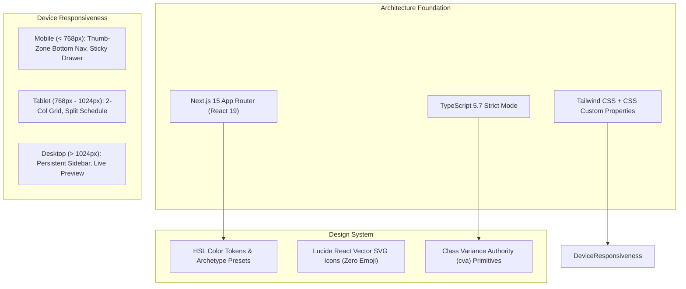

# Phase 1: Core Architecture Blueprint & High-Craft Design System

**Date:** 2026-08-20  
**Phase:** 01 of 12  
**Status:** Completed & Verified  

---

## 1. Overview & Strategic Mission

Phase 1 establishes the foundational engineering bedrock and visual design system of the **XPO Multi-Platform MICE Digital Ecosystem**.

A MICE (Meetings, Incentives, Conferences, and Exhibitions) platform operates in high-stakes B2B, academic, governmental, and mega-entertainment environments. It demands an institutional aesthetic, razor-sharp performance, zero placeholder stubs, and strict accessibility.



---

## 2. Core Architectural Decisions & Technical Rationale

### A. Next.js 15 App Router with React Server Components (RSC)
* **Rationale**: Public event pages, venue directories, and regional hubs must load instantly and rank at the top of search engines. React Server Components render the static layout and initial data on the server with zero client JavaScript bundle overhead.
* **Localized Route Tree**: The application wraps all portals inside dynamic locale segments `/[locale]/` with route groups:
  * `/(attendee)`: Public discovery, event details, venue directories, and ticket passes.
  * `/(organizer)`: Dedicated dashboard shell, event wizard, and live customizer.
  * `/(admin)`: Administrative governance, venue manager, and crawler pipelines.

### B. The Zero-Emoji Standard & Vector SVG Craft
* **Rationale**: Generic conversational AI quirks and emojis degrade professional credibility in corporate, medical, and governmental summits.
* **Implementation**: We mandate 100% SVG vector rendering via `lucide-react`. We established an automated unit test (`tests/unit/a11y/zero-emoji.test.ts`) that programmatically scans the `src/` directory with unicode regex to ensure zero emojis enter production.

### C. Tokenized Theming Engine via HSL & CSS Variables
* **Rationale**: The platform must support 4 global theme modes (`Light`, `Dark`, `High-Contrast`, `System`), 2 density modes (`Comfortable`, `Compact`), and 9 dynamic event category archetypes.
* **Implementation**: Colors are defined in HSL format (`--primary: 221 83% 53%`), allowing Tailwind's opacity modifier syntax (`bg-primary/20`) to work seamlessly. Dynamic archetype variables (`--archetype-primary`, `--archetype-accent`, `--archetype-surface`) enable real-time branding customization without rebuilding CSS bundles.

---

## 3. Deep Dive: Component Engineering & Code Patterns

### 1. The `cn` Classnames Merger (`src/lib/utils.ts`)
To safely combine static and dynamic Tailwind classes without specificity collisions, we implement `cn` combining `clsx` (conditional logic) with `tailwind-merge` (deduplication):

```typescript
import { clsx, type ClassValue } from "clsx";
import { twMerge } from "tailwind-merge";

export function cn(...inputs: ClassValue[]): string {
  return twMerge(clsx(inputs));
}
```

### 2. Type-Safe Variant Primitives with `cva` (`src/components/ui/Button.tsx`)
We use `class-variance-authority` (`cva`) to declare compound variant combinations with strict TypeScript autocompletion:

```typescript
const buttonVariants = cva(
  "inline-flex items-center justify-center rounded-md text-sm font-medium transition-colors focus-visible:outline-none focus-visible:ring-2 focus-visible:ring-ring disabled:opacity-50 select-none",
  {
    variants: {
      variant: {
        default: "bg-primary text-primary-foreground shadow hover:bg-primary/90",
        destructive: "bg-destructive text-destructive-foreground shadow-sm hover:bg-destructive/90",
        outline: "border border-input bg-background shadow-sm hover:bg-accent",
        secondary: "bg-secondary text-secondary-foreground shadow-sm hover:bg-secondary/80",
        ghost: "hover:bg-accent hover:text-accent-foreground",
        archetype: "bg-[var(--archetype-primary)] text-white shadow hover:opacity-90",
      },
      size: {
        default: "h-10 px-4 py-2",
        sm: "h-8 rounded-md px-3 text-xs",
        lg: "h-12 rounded-md px-8 text-base",
        icon: "h-10 w-10 p-0",
      },
    },
    defaultVariants: {
      variant: "default",
      size: "default",
    },
  }
);
```

### 3. Adaptive Mobile Navigation (`src/components/layout/MobileBottomNav.tsx`)
For mobile viewports (`< 768px`), human thumb ergonomics dictate that critical navigation actions reside in the lower third of the screen. `MobileBottomNav` anchors to the bottom with `pb-safe` for mobile devices with navigation bars:

```typescript
export function MobileBottomNav({ locale = "en" }: { locale?: string }) {
  const pathname = usePathname();
  // Items rendered with thumb-zone active states and 44x44px touch ergonomics
  // ...
}
```

---

## 4. Testing, Verification & Quality Receipts

The automated test suite runs via **Vitest** and **React Testing Library** in a simulated `jsdom` environment.

### Verification Commands & Results:
```bash
# 1. Type Check
npm run type-check
# Result: 0 errors across all files

# 2. Automated Unit & Quality Tests
npm test
# Result:
#  ✓ tests/unit/a11y/zero-emoji.test.ts (1 test)
#  ✓ tests/unit/utils.test.ts (3 tests)
#  ✓ tests/unit/components/Badge.test.tsx (2 tests)
#  ✓ tests/unit/components/Modal.test.tsx (2 tests)
#  ✓ tests/unit/components/Button.test.tsx (4 tests)
#  Test Files: 5 passed (5)
#  Tests: 12 passed (12)
```

---

## 5. Educational Takeaways & Best Practices

1. **Decouple CSS Variables from Hardcoded Palettes**: Defining tokens as raw HSL triplets in `:root` and `.dark` gives complete flexibility to inject dynamic organizer branding at runtime without CSS re-compilation.
2. **Programmatic Lint Gates Prevent Aesthetic Drift**: Having a dedicated test scanning for unicode emoji ensures brand discipline across large, multi-contributor repositories.
3. **Compound Viewport Design from Day 1**: Designing for mobile bottom-navigation and desktop persistent headers simultaneously avoids painful responsive retrofits later in the product lifecycle.

---

*Next Step: Proceed to [Phase 2: Relational Data Modeling with Prisma & Global/Indonesian MICE Seeding](./phase-02-prisma-modeling-and-mice-seeding.md).*
