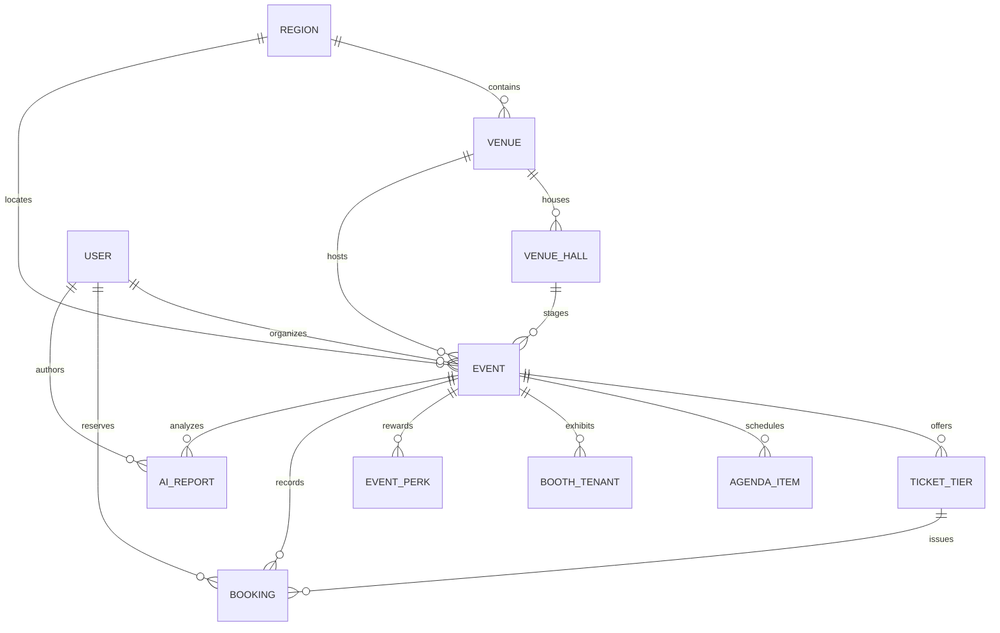

# Phase 2: Relational Data Modeling with Prisma & Global/Indonesian MICE Seeding

**Date:** 2026-08-20  
**Phase:** 02 of 12  
**Status:** Completed & Verified  

---

## 1. Overview & Data Architecture Mission

Phase 2 establishes the core relational data layer for the **XPO MICE Ecosystem** using **Prisma ORM**.

A MICE data architecture is inherently hierarchical and multi-sided:
* **Venues** contain distinct **Halls/Rooms** with individual capacities and transit instructions.
* **Events** are mapped to both a host venue and a specific hall, configured with a domain **Archetype**, dynamic branding, tiered **Tickets**, multi-track **Agendas**, exhibitor **Booths**, and tier-gated **Perks**.
* **Attendees** book tickets that generate cryptographic tamper-proof **QR Code Hashes**.
* **Organizers** generate multi-model **AI Analytics Reports** linked to live event telemetry.



---

## 2. Deep Dive: Prisma Schema Design (`prisma/schema.prisma`)

### A. The Venue & Hall Hierarchy
Unlike generic event platforms where a venue is just an address string, MICE trade shows require granular hall mapping. An event like *Manufacturing Indonesia* might occupy Halls A1–D2, while a keynote at *ICE BSD* is staged in *Nusantara Hall 2*:

```prisma
model Venue {
  id          String      @id @default(cuid())
  regionId    String
  region      Region      @relation(fields: [regionId], references: [id])
  name        String      // e.g. "JIExpo Kemayoran"
  slug        String      @unique
  city        String
  address     String
  latitude    Float?
  longitude   Float?
  transitInfo String      // KRL, MRT, TransJakarta instructions
  imageUrl    String?
  halls       VenueHall[]
  events      Event[]
  createdAt   DateTime    @default(now())
}

model VenueHall {
  id           String   @id @default(cuid())
  venueId      String
  venue        Venue    @relation(fields: [venueId], references: [id], onDelete: Cascade)
  name         String   // e.g. "Hall A1", "Nusantara Hall 2", "Plenary Hall"
  capacity     Int?
  floorAreaSqm Float?
  description  String?
  events       Event[]
}
```

### B. The 9 MICE Category Archetypes
The `archetype` string attribute governs which UI view component and CSS theme token set is activated:
1. `INDUSTRIAL_B2B` (Heavy machinery, B2B procurement tables, RFQ drawer)
2. `TECH_DEV_SUMMIT` (Multi-track schedules, GitHub tags, live code streams)
3. `MEDICAL_SYMPOSIUM` (Abstract readers, CME credit counters, accreditation badges)
4. `FINANCE_INVESTOR` (Deal-room booking, pitch decks, encrypted badges)
5. `POP_CULTURE_GAMING` (Cosplay rules, creator alley, merchandise wishlists)
6. `MUSIC_FESTIVAL` (Stage timelines, crowd-meters, gate entry guides)
7. `MEGA_EXPO_PAVILION` (Multi-pavilion hall directory, fireworks, tenant promo radar)
8. `GOVERNMENT_DIPLOMATIC` (Protocol briefings, bilateral schedule, delegation pass)
9. `INCENTIVE_RETREAT` (Itinerary planner, gala dinner seating, wellness scheduler)

---

## 3. Indonesian & Global Venue Seeding Engine (`prisma/seed.ts`)

The database seeding engine populates real-world, high-fidelity venue profiles:

### Indonesian Spotlight Venues Seeded:
1. **JIExpo Kemayoran (Jakarta)**:
   * *Halls*: Hall A1-A3 (Heavy Machinery), Hall B1-B3, Hall C1-C3, Hall D1-D2 (Grand Exhibition Hall), Grand Ballroom, Open Space Arena.
   * *Transit*: TransJakarta Corridor 2C & 12M, KRL Stasiun Rajawali & Kemayoran.
2. **ICE BSD City (Tangerang)**:
   * *Halls*: Exhibition Halls 1-10, Nusantara Hall 2 (4,000 cap), Convention Halls 1-3.
   * *Transit*: BSD Link Shuttle, KRL Stasiun Rawa Buntu & Cisauk.
3. **JICC Senayan / Balai Sidang (Central Jakarta)**:
   * *Halls*: Plenary Hall (5,000 seats), Assembly Hall (3,000 seats), Cendrawasih Room, Exhibition Halls A & B.
   * *Transit*: MRT Istora Mandiri, TransJakarta JCC Senayan.
4. **NICE PIK 2 (Tangerang)**:
   * *Halls*: Exhibition Halls 1-8, Grand Ballroom, Atrium Central.
   * *Transit*: PIK 2 Shuttle Bus, Toll Interchange PIK 2.
5. **GBK Sports Complex (Senayan)**:
   * *Halls*: Istora Senayan, Stadion Utama GBK, Tennis Indoor Senayan, Basket Hall, Parkir Timur Expo.
   * *Transit*: MRT Senayan & Istora Mandiri, TransJakarta GBK.
6. **JIS (Jakarta International Stadium)**:
   * *Halls*: Main Arena Stadium (82,000 cap), West VIP Lounge, Concourse Level 3.
   * *Transit*: KRL Stasiun Ancol / JIS, TransJakarta 14.

### Japan & Global Showcase Venues Seeded:
* **Tokyo Big Sight**: East Halls 1-8, West Halls 1-4, South Halls 1-4, Conference Tower.
* **Marina Bay Sands Expo (Singapore)**: Sands Expo Halls A-F, Grand Ballroom Level 5.

---

## 4. Testing, Verification & Quality Receipts

Database relations, foreign key integrity, and query speeds are verified using Vitest integration tests in [`tests/integration/db.test.ts`](../../tests/integration/db.test.ts).

### Verification Command & Results:
```bash
# Execute Vitest suite
npm test

# Results:
#  ✓ tests/unit/a11y/zero-emoji.test.ts (1 test)
#  ✓ tests/unit/utils.test.ts (3 tests)
#  ✓ tests/integration/db.test.ts (4 tests)
#  ✓ tests/unit/components/Badge.test.tsx (2 tests)
#  ✓ tests/unit/components/Modal.test.tsx (2 tests)
#  ✓ tests/unit/components/Button.test.tsx (4 tests)
# Test Files: 6 passed (6) | Tests: 16 passed (16)
```

---

## 5. Educational Takeaways & Best Practices

1. **Explicit 1-to-Many Venue/Hall Relations**: Modeling halls as first-class entities prevents string fragmentation (e.g. "Hall 1", "Hall 01", "H-1") and enables accurate spatial navigation and AI transit guidance.
2. **Polymorphic Benefits via Structured JSON**: Storing ticket benefits and MICE interest tags as typed JSON structures allows dynamic front-end badge rendering without exploding the schema with dozens of micro-tables.
3. **Idempotent Seed Scripts**: Always deleting child entities first or using clean re-population prevents unique constraint collisions when re-running migrations during local iteration.

---

*Next Step: Proceed to [Phase 3: Multilingual i18n & Regional Localization Routing](./phase-03-multilingual-and-regional-routing.md).*
