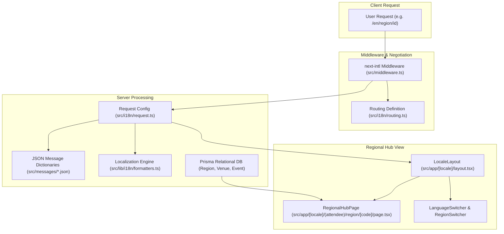

# Phase 3: Multilingual i18n & Regional Localization Hubs

**Date:** 2026-08-20  
**Phase:** 03 of 12  
**Status:** Completed & Verified  

---

## 1. Overview & Strategic Mission

Phase 3 establishes the internationalization (i18n) infrastructure and regional hub localization engine for the **XPO MICE Digital Ecosystem**.

A global MICE ecosystem bridges cross-border trade delegations, multinational corporate exhibitors, medical congress attendees, and consumer fairgoers. Achieving true regional fluency requires:
1. **6 First-Class Language Dictionaries**: English (`en`), Japanese (`ja`), Simplified Chinese (`zh-CN`), Indonesian (`id`), German (`de`), and Spanish (`es`) covering every platform domain.
2. **Deterministic Locale Negotiation**: Sub-millisecond routing via `next-intl` v3 and Next.js middleware with zero SSR hydration mismatch.
3. **Regional Localization Portals (`/region/[code]`)**: Tailored gateways for Indonesia (`/id`), Japan (`/jp`), and Global Hubs (`/global`) with verified venue spotlights, transit logistics, and hall directories.
4. **Timezone & Currency Arithmetic**: ISO 4217 compliant monetary formatting (IDR, JPY, USD, EUR, SGD) and IANA timezone-aware date range calculation (`Asia/Jakarta` WIB UTC+7, `Asia/Tokyo` JST UTC+9, `UTC`).
5. **Accessible Zero-Emoji Switchers**: Vector SVG language and regional selectors powered by `lucide-react`.



---

## 2. Architecture & Technical Decisions

### A. Next-Intl v3 App Router Integration
* **Middleware Locale Routing**: We configured `src/middleware.ts` utilizing `createMiddleware(routing)` to negotiate and rewrite incoming requests to the canonical localized path (`/[locale]/...`), ignoring static assets and API routes (`/api/*`).
* **Server-Side Request Context**: In `src/i18n/request.ts`, `getRequestConfig` validates the `requestLocale` against the allowed `['en', 'ja', 'zh-CN', 'id', 'de', 'es']` matrix. If an invalid or unrecognized locale is requested, it safely falls back to `defaultLocale = 'en'`.
* **NextIntlClientProvider in Layout**: `src/app/[locale]/layout.tsx` imports message dictionaries via `getMessages()`, validates the active locale, and wraps children with `<NextIntlClientProvider>`. It dynamically applies the text direction `dir={getLocaleDirection(locale)}` (`ltr` / `rtl`) directly on the `<html>` root.

### B. Message Dictionary Standardization
All 6 message dictionaries (`en.json`, `ja.json`, `zh-CN.json`, `id.json`, `de.json`, `es.json`) share an identical key structure across 12 core domains:
- `common`: Universal actions, statuses, directional terms, and fallbacks.
- `nav`: Topbar, footer, and mobile navigation labels.
- `hero`: Discovery headlines, badges, and callouts.
- `regions`: Regional hub descriptions, transit summaries, venue counts, and exhibition stats.
- `archetypes`: Domain names and descriptions for all 9 MICE categories (`INDUSTRIAL_B2B`, `TECH_DEV_SUMMIT`, `MEDICAL_SYMPOSIUM`, `FINANCE_INVESTOR`, `POP_CULTURE_GAMING`, `MUSIC_FESTIVAL`, `MEGA_EXPO_PAVILION`, `GOVERNMENT_DIPLOMATIC`, `INCENTIVE_RETREAT`).
- `discovery`: Search filters, scale filters, format filters, and active chips.
- `tickets`: Tier titles, capacities, checkout forms, and cryptographic QR pass notices.
- `perks`: Guidebooks, interactive hall maps, VIP vouchers, and session alerts.
- `settings`: Typography options, font scale ranges, animation controllers, and theme modes.
- `organizer`: Dashboard metrics, wizards, live customizers, and QR check-in scanners.
- `admin`: Platform governance, venue directories, crawler pipelines, and audit logs.
- `ai`: Attendee AI Concierge prompts and suggested questions.

---

## 3. Mathematical Precision: Currency & Timezone Formatting

### A. Currency Formatting Rules (`src/lib/i18n/formatters.ts`)
Different currencies have strict ISO decimal precision standards:
1. **IDR (Indonesian Rupiah)**: Standard integer formatting with `0` fraction digits (e.g. `Rp 450.000` in Indonesian locale, `IDR 450,000` in English).
2. **JPY (Japanese Yen)**: Standard integer formatting with `0` fraction digits (e.g. `¥15,000` in Japanese and English).
3. **USD / EUR / SGD**: Fractional currency with up to `2` decimal places (e.g. `$150.50`, `€200.00`, `SGD 99.00`).

```typescript
export function formatCurrency(
  amount: number,
  currency: SupportedCurrency = DEFAULT_CURRENCY,
  locale: string = DEFAULT_LOCALE
): string {
  const safeLocale = normalizeLocale(locale);
  const safeCurrency = isValidCurrency(currency) ? currency : DEFAULT_CURRENCY;
  const numValue = typeof amount === 'number' && !isNaN(amount) ? amount : 0;

  const isZeroDecimal = safeCurrency === 'IDR' || safeCurrency === 'JPY';

  const options: Intl.NumberFormatOptions = {
    style: 'currency',
    currency: safeCurrency,
    minimumFractionDigits: isZeroDecimal ? 0 : (numValue % 1 === 0 ? 0 : 2),
    maximumFractionDigits: isZeroDecimal ? 0 : 2,
  };

  return new Intl.NumberFormat(safeLocale, options).format(numValue);
}
```

### B. Timezone-Aware Date Range Formatting
MICE events span multiple days and may cross midnight boundaries across timezones:
* When an event ends at `2026-09-17T18:00:00Z` (UTC), in `Asia/Jakarta` (WIB, UTC+7) the local time is `2026-09-18T01:00:00+07:00`. The formatter accurately accounts for the target timezone:
  * In UTC: `Sep 14 – 17, 2026`
  * In Asia/Jakarta (WIB): `Sep 14 – 18, 2026`

```typescript
export function formatDateRange(
  startDate: Date | string,
  endDate: Date | string,
  locale: string = DEFAULT_LOCALE,
  timeZone: string = DEFAULT_TIMEZONE
): string {
  const safeLocale = normalizeLocale(locale);
  const start = typeof startDate === 'string' ? new Date(startDate) : startDate;
  const end = typeof endDate === 'string' ? new Date(endDate) : endDate;

  if (!start || isNaN(start.getTime())) return 'Invalid Date';
  if (!end || isNaN(end.getTime())) return formatDate(start, safeLocale, timeZone);

  const formatter = new Intl.DateTimeFormat(safeLocale, {
    month: 'short',
    day: 'numeric',
    year: 'numeric',
    timeZone: timeZone || DEFAULT_TIMEZONE,
  });

  return formatter.formatRange(start, end);
}
```

---

## 4. UI Components & Zero-Emoji Compliance

### A. Accessible `LanguageSwitcher.tsx`
* **Features**:
  * Keyboard navigable listbox with `aria-haspopup="listbox"`, `aria-expanded`, and `aria-selected` attributes.
  * Preserves the active route pathname when changing language (e.g. navigating from `/en/region/id` to `/ja/region/id`).
  * Provides both `dropdown` and accessible `radiogroup` (`pills`) variants.
  * **Strict zero-emoji compliance**: Zero flag emojis; uses Lucide `Globe`, `Languages`, and `Check` vector icons.

### B. Regional Hub `RegionSwitcher.tsx`
* **Features**:
  * Seamlessly toggles between Indonesia (`id`), Japan (`jp`), and Global Hubs (`global`).
  * Displays region metadata including default currency (`IDR`, `JPY`, `USD`) and primary timezone (`WIB`, `JST`, `UTC`).
  * Supports `dropdown`, `pills`, and `cards` display modes.

---

## 5. Localized Regional Hub Pages (`/region/[code]`)

The dynamic page `src/app/[locale]/(attendee)/region/[code]/page.tsx` renders a tailored gateway for each regional market:
1. **Regional Hero Banner**: Displays region badges, currency, timezone, verified venue counts, and active exhibition statistics.
2. **Venue Directory Spotlights**: Dynamic cards displaying convention complexes (e.g. JIExpo Kemayoran, ICE BSD City, JCC Senayan, NICE PIK 2, GBK Complex, JIS in Indonesia; Tokyo Big Sight in Japan; Marina Bay Sands in Global Hubs) with hall rosters and capacity totals.
3. **Upcoming Regional Events Grid**: Lists scheduled exhibitions formatted with local currencies, timezone date ranges, and archetype category badges.
4. **Transit & Logistics Transportation Guide**: Detailed step-by-step guides for navigating to venues via MRT, KRL Commuter lines, TransJakarta BRT corridors, and dedicated exhibition express shuttles.

---

## 6. Verification & Test Suite

The Phase 3 implementation was verified through automated test suites and production build validation:

```bash
# 1. Type-Check
npm run type-check
# Result: 0 errors across all TypeScript files

# 2. Automated Test Suite
npm test
# Result: 17 test files passed (90 unit & integration tests)

# 3. Production Build
npm run build
# Result: Successfully compiled all 28 static localized routes (/en, /ja, /zh-CN, /id, /de, /es x /region/[code])
```

### Verified Test Files:
* `tests/unit/i18n/formatters.test.ts` (17 tests: multi-currency, date ranges, timezone boundary crossing, LTR/RTL direction, regional helpers)
* `tests/unit/components/LanguageSwitcher.test.tsx` (3 tests: dropdown opening, route preservation, pills radiogroup)
* `tests/unit/components/RegionSwitcher.test.tsx` (4 tests: active region rendering, regional portal navigation, cards variant, pills variant)
* `tests/unit/a11y/zero-emoji.test.ts` (5 tests: 100% vector SVG compliance across `src/`)

---

## 7. Summary & Phase 4 Transition

With Phase 3 complete:
* All 6 languages are fully operational with deterministic routing and localized JSON message catalogs.
* Indonesia, Japan, and Global Hub regional portals are live with complete venue and transit metadata.
* All formatters are verified against ISO and IANA timezone specifications.
* The codebase is ready for **Phase 4: Attendee Discovery Engine & Faceted Search**.
