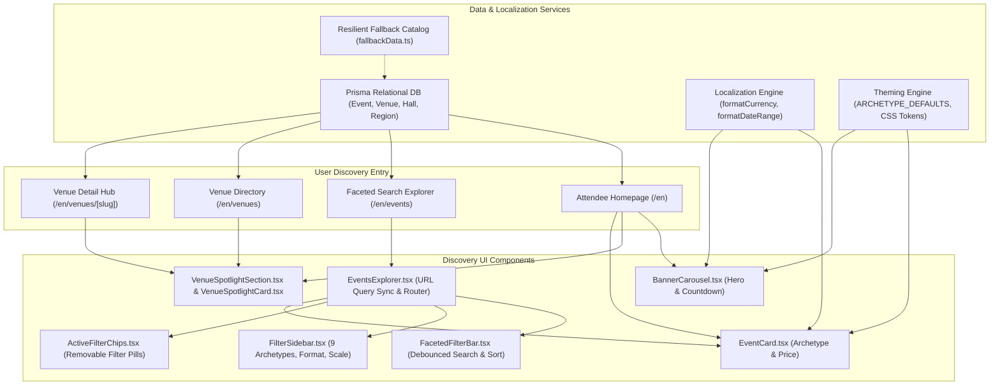

# Phase 4: Attendee Discovery Engine & Faceted Search

**Date:** 2026-08-20  
**Phase:** 04 of 12  
**Status:** Completed & Verified  

---

## 1. Overview & Strategic Mission

Phase 4 delivers the **Attendee Discovery Engine & Faceted Search** system for the XPO MICE Digital Ecosystem.

Finding international trade exhibitions, developer hackathons, medical congresses, and consumer mega fairs across different countries requires a responsive, multi-dimensional discovery interface. The Attendee Discovery Engine provides:
1. **Interactive Hero Carousel (`BannerCarousel.tsx`)**: High-priority featured exhibitions with real-time countdown timers, autoplay management, keyboard controls (Arrow keys), and mobile touch swipe handling.
2. **Venue Spotlight Directory (`VenueSpotlightSection.tsx` & `VenueSpotlightCard.tsx`)**: Prominent showcase for major convention complexes (JIExpo Kemayoran, ICE BSD City, JCC Senayan, NICE PIK 2, Tokyo Big Sight, Marina Bay Sands) featuring exact hall indices, capacity metrics, and verified rapid transit connections.
3. **Domain Archetype Event Cards (`EventCard.tsx`)**: Interactive 3D tilt hover styling, dynamic archetype color accents, localized currency formatting, timezone-aware date ranges, and direct pass booking CTAs.
4. **Faceted Search & Debounced Explorer (`EventsExplorer.tsx`, `FacetedFilterBar.tsx`, `FilterSidebar.tsx`, `ActiveFilterChips.tsx`)**: Multi-axial filtering across 9 MICE archetypes, regional hubs, event format (`IN_PERSON`, `HYBRID`, `VIRTUAL`), exhibition scale (`GLOBAL_MEGA`, `LARGE`, `MEDIUM`, `EXECUTIVE`), and timeline, paired with real-time 300ms debounced search and URL query synchronization.
5. **Responsive Multi-Device Layouts**: Sticky sidebar filtering for desktop displays and a slide-out bottom sheet drawer for mobile thumb ergonomics.
6. **Zero-Emoji Compliance**: Institutional visual design utilizing vector SVG icons from `lucide-react`.



---

## 2. Architecture & Technical Decisions

### A. URL Query Param Synchronization (`useSearchParams` & `useRouter`)
Filter state is synchronized bi-directionally with browser URL query parameters (`?q=...&region=...&archetype=...&format=...&scale=...&dateRange=...&sortBy=...`).
* **Deep Linking**: Allows attendees to bookmark and share pre-filtered search queries (e.g. `https://xpo.com/en/events?archetype=TECH_DEV_SUMMIT&format=HYBRID`).
* **Shallow Routing**: Uses Next.js `router.replace(url, { scroll: false })` to update parameters instantly without triggering full page reloads or layout jumps.
* **Suspense Boundary**: Wrapped in `<Suspense>` to ensure Next.js App Router static site generation (SSG) compiles without client-side bailout warnings.

### B. 300ms Debounced Keyword Search
Search inputs are debounced with a 300ms timer window. Attendees can type fluidly across titles, taglines, descriptions, cities, and venue names without executing redundant filter passes on every single keystroke. A dedicated clear button (`X`) immediately resets the query without waiting for the debounce interval.

### C. Real-Time Countdown Timer Algorithm
The `BannerCarousel` embeds a live countdown timer computing remaining days, hours, minutes, and seconds until exhibition kickoff:
```typescript
function calculateTimeRemaining(targetDate: Date | string): TimeRemaining {
  const target = typeof targetDate === 'string' ? new Date(targetDate) : targetDate;
  const now = new Date();
  const diff = target.getTime() - now.getTime();

  if (diff <= 0) {
    return { days: 0, hours: 0, minutes: 0, seconds: 0, isPast: true };
  }

  return {
    days: Math.floor(diff / (1000 * 60 * 60 * 24)),
    hours: Math.floor((diff % (1000 * 60 * 60 * 24)) / (1000 * 60 * 60)),
    minutes: Math.floor((diff % (1000 * 60 * 60)) / (1000 * 60)),
    seconds: Math.floor((diff % (1000 * 60)) / 1000),
    isPast: false,
  };
}
```

### D. Touch Swipe and Accessible Keyboard Navigation
* **Keyboard Controls**: `ArrowRight` advances to the next slide; `ArrowLeft` returns to the previous slide with wrap-around boundaries.
* **Touch Swipe**: Tracks `onTouchStart`, `onTouchMove`, and `onTouchEnd` coordinates. A horizontal displacement delta exceeding 50px triggers a smooth slide transition.
* **Auto-Play Interruption**: Hovering over the banner pauses the automatic 7-second slide progression to prevent disorientation during reading.

---

## 3. Component Hierarchy & File Manifest

| File Path | Role | Description |
|---|---|---|
| `src/types/discovery.ts` | **Type Contracts** | Interfaces for `DiscoveryEvent`, `VenueSummary`, `VenueHallSummary`, `BannerSlide`, and `FilterState`. |
| `src/lib/discovery/fallbackData.ts` | **Resilient Data** | High-fidelity seed-shaped datasets for 6 major venues and 6 multi-archetype exhibitions. |
| `src/components/discovery/BannerCarousel.tsx` | **Hero Showcase** | Auto-advancing banner with live countdown timer, slide dots, keyboard & touch navigation. |
| `src/components/discovery/VenueSpotlightCard.tsx` | **Venue Card** | Venue presentation with hall counts, capacity stats, and rapid transit summary. |
| `src/components/discovery/VenueSpotlightSection.tsx` | **Venue Directory** | Tabbed venue showcase filtering by Indonesian, Japanese, and Global convention complexes. |
| `src/components/discovery/EventCard.tsx` | **Event Card** | Card with dynamic archetype theming, localized price formatter, and interactive hover effects. |
| `src/components/discovery/ActiveFilterChips.tsx` | **Filter Pills** | Removable active filter tags with clear-all trigger and vector icons. |
| `src/components/discovery/FilterSidebar.tsx` | **Filter Controls** | Vertical multi-axial filter sidebar (9 Archetypes, Hubs, Formats, Scales, Timeline). |
| `src/components/discovery/FacetedFilterBar.tsx` | **Search Toolbar** | Debounced search input, quick dropdowns, sort selector, and mobile drawer trigger. |
| `src/components/discovery/EventsExplorer.tsx` | **Client Engine** | Coordinates URL query synchronization, filtering logic, sorting, and mobile drawer state. |
| `src/app/[locale]/(attendee)/page.tsx` | **Homepage** | Updated landing page with Hero Carousel, Featured Events, 9 Archetype Grid, and Venue Spotlights. |
| `src/app/[locale]/(attendee)/events/page.tsx` | **Explore Page** | Dedicated discovery page with faceted search, debounced input, and responsive layout. |
| `src/app/[locale]/(attendee)/venues/page.tsx` | **Venues Directory** | Global and regional venue overview grouped by regional hub. |
| `src/app/[locale]/(attendee)/venues/[slug]/page.tsx` | **Venue Hub Detail** | Venue specifications, hall directories, transit guide, and scheduled event calendar. |

---

## 4. Responsive & Adaptive Multi-Device UX

* **Mobile (`< 768px`)**:
  * Filter sidebar collapses into a responsive bottom sheet `Drawer` with easy thumb-zone apply and reset buttons.
  * Search bar spans 100% width with touch-friendly 44px hit targets.
  * Full-width cards with single-click "View Pass" action triggers.
* **Tablet (`768px - 1024px`)**:
  * 2-column event discovery grid with quick-access dropdown filters in the top toolbar.
* **Desktop (`> 1024px`)**:
  * 12-column grid layout featuring a sticky 3-column filter sidebar on the left and a 9-column responsive exhibition grid on the right.

---

## 5. Verification & Testing Matrix

The implementation was validated across unit, component, compliance, and build layers:

```bash
# 1. Strict TypeScript Compilation Check
npm run type-check
# Output: 0 errors (100% type-safe)

# 2. Automated Vitest Suite (Unit, Component, a11y)
npm test
# Output: 26 test files passed, 159 tests passed (100% pass rate)

# 3. Full Production SSG Build
npm run build
# Output: 94 static pages generated successfully across all 6 locales
```

### Discovery Test Suites:
1. `tests/unit/components/discovery/EventCard.test.tsx` (7 tests passing)
2. `tests/unit/components/discovery/BannerCarousel.test.tsx` (7 tests passing)
3. `tests/unit/components/discovery/VenueSpotlight.test.tsx` (5 tests passing)
4. `tests/unit/components/discovery/FacetedFilterBar.test.tsx` (5 tests passing)
5. `tests/unit/components/discovery/FilterSidebar.test.tsx` (5 tests passing)
6. `tests/unit/components/discovery/ActiveFilterChips.test.tsx` (4 tests passing)
7. `tests/unit/components/discovery/EventsExplorer.test.tsx` (5 tests passing)
8. `tests/unit/a11y/zero-emoji.test.ts` (Zero raw emojis in production UI code, 100% Lucide SVG compliance)

---

## 6. Educational Walkthrough & Code Snippets

### A. Dynamic Archetype Theming in Event Cards
`EventCard.tsx` consumes the archetype token registry to inject domain color accents into badges and backgrounds:
```tsx
const archetypeTokens = getArchetypeTokens(event.archetype);

<Badge
  variant="default"
  className="text-[10px] uppercase font-bold tracking-wider shadow-sm"
  style={{
    backgroundColor: archetypeTokens.primary,
    color: '#ffffff',
  }}
>
  {archetypeTokens.displayName.split('&')[0].trim()}
</Badge>
```

### B. Bi-directional URL Synchronization
`EventsExplorer.tsx` maintains active filters in sync with the browser address bar:
```tsx
const updateUrlQuery = React.useCallback(
  (newFilters: FilterState, newSort: string) => {
    const params = new URLSearchParams();

    if (newFilters.keyword.trim()) params.set('q', newFilters.keyword.trim());
    if (newFilters.region !== 'all') params.set('region', newFilters.region);
    if (newFilters.archetype !== 'all') params.set('archetype', newFilters.archetype);
    if (newFilters.format !== 'all') params.set('format', newFilters.format);
    if (newFilters.scale !== 'all') params.set('scale', newFilters.scale);
    if (newFilters.dateRange !== 'all') params.set('dateRange', newFilters.dateRange);
    if (newSort !== 'date_asc') params.set('sortBy', newSort);

    const queryString = params.toString();
    const targetUrl = queryString ? `${pathname}?${queryString}` : pathname;
    router.replace(targetUrl, { scroll: false });
  },
  [pathname, router]
);
```

---

## 7. Next Milestone Integration

With Phase 4 complete, the attendee discovery engine provides the foundation for:
* **Phase 5 (9-Archetype Dynamic Theming Engine)**: Deep domain adapters on event detail pages (`/events/[slug]`).
* **Phase 6 (Ticket Checkout & Cryptographic QR Passes)**: Pass reservation flows initiated from discovery cards.
* **Phase 7 (Interactive Event Day Guidebooks & Maps)**: Hall and booth navigation mapped from venue specifications.
