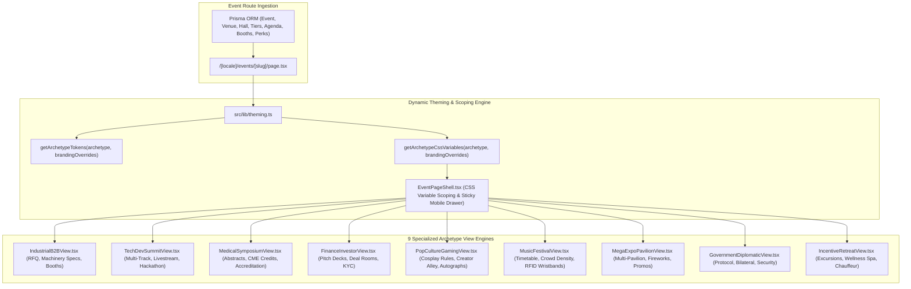

# Phase 5: 9-Archetype Dynamic MICE Category Theming Engine

**Date:** 2026-08-20  
**Phase:** 05 of 12  
**Status:** Completed & Verified  

---

## 1. Overview & Strategic Mission

Phase 5 introduces the **9-Archetype Dynamic MICE Category Theming Engine** to the XPO platform.

The Meetings, Incentives, Conferences, and Exhibitions (MICE) industry encompasses vastly distinct event types. A heavy industrial manufacturing machinery trade fair has fundamentally different attendee needs, aesthetic requirements, and functional workflows compared to a high-security intergovernmental diplomatic summit, an esports cosplay gaming expo, or a peer-reviewed medical symposium.

Instead of generic, one-size-fits-all event detail pages, XPO dynamically adapts its UI/UX, typography, color palettes, surface tokens, and interactive components based on the event's **MICE Category Archetype**:

1. **Industrial & Manufacturing B2B (`INDUSTRIAL_B2B`)**: Heavy equipment specifications, Request for Quotation (RFQ) procurement tender drawer, machine tool catalog, and B2B deal-room meeting slots.
2. **Technology & Developer Summit (`TECH_DEV_SUMMIT`)**: Multi-track keynote schedules (AI/ML, Distributed Systems, Cloud Native), speaker GitHub/X tags, live WebRTC stage streaming player widget, and 48-hour Hackathon RSVP with $25k bounty breakdown.
3. **Medical & Clinical Symposium (`MEDICAL_SYMPOSIUM`)**: Peer-reviewed scientific abstract accordion reader with DOI references, Continuing Medical Education (CME) credit counter & physician license registration, and speaker medical accreditation badges.
4. **Finance, Banking & Investor Summit (`FINANCE_INVESTOR`)**: Curated growth-stage pitch decks, private bilateral deal-room booking, KYC Level-3 encryption badge, and Chatham House Rule protocol briefings.
5. **Pop Culture & Gaming Expo (`POP_CULTURE_GAMING`)**: Cosplay prop safety & costume security guidelines, Creator Alley artist tables with exclusive merch drop radar, and celebrity voice actor autograph/photo-op reservation.
6. **Music Festival & Live Entertainment (`MUSIC_FESTIVAL`)**: Multi-stage live timetable, stage crowd density sensor telemetry (Green / Amber / Red meters), and RFID NFC wristband cashless ecosystem guide.
7. **Mega Fair & Multi-Pavilion Expo (`MEGA_EXPO_PAVILION`)**: Multi-pavilion hall directory (Automotive, Consumer Electronics, Culinary, Home Furnishings), nightly fireworks spectacle schedule, and tenant coupon flash discount radar.
8. **Diplomatic & Government Summit (`GOVERNMENT_DIPLOMATIC`)**: Official protocol briefings & diplomatic dress code guidelines, sovereign delegation suites, bilateral audience scheduler, and high-security clearance credentials.
9. **Corporate Incentive & Luxury Retreat (`INCENTIVE_RETREAT`)**: Curated daily excursion itinerary (private yacht cruises, temple meditation, ocean amphitheatres), wellness & spa holistic appointment scheduler, and VIP airport chauffeur hospitality notes.



---

## 2. Architecture & Technical Decisions

### A. CSS Custom Property Injection Scoping
Rather than relying on static stylesheets or bulky CSS-in-JS runtimes, `getArchetypeCssVariables` computes an inline CSS variable dictionary injected directly onto the `EventPageShell` root element:

```typescript
export function getArchetypeCssVariables(
  archetype: MiceArchetype | string,
  overrides?: BrandingConfig
): Record<string, string> {
  const tokens = getArchetypeTokens(archetype, overrides);
  return {
    "--archetype-primary": tokens.primary,
    "--archetype-accent": tokens.accent,
    "--archetype-bg": tokens.background,
    "--archetype-surface": tokens.surface,
    "--archetype-border": tokens.border,
  };
}
```

This design allows Tailwind utility classes such as `bg-[var(--archetype-primary)]`, `text-[var(--archetype-accent)]`, and `border-[var(--archetype-border)]` to automatically render with archetype-specific color palettes and surface backgrounds with zero SSR hydration delay.

### B. Organizer Branding Overrides
Organizers can customize primary and accent brand colors, provide a custom hero badge, and tune banner overlay opacity via `brandingConfigJson`. The override engine gracefully merges organizer brand preferences with archetype defaults:

```typescript
export function getArchetypeTokens(
  archetype: MiceArchetype | string,
  overrides?: BrandingConfig
): ArchetypeThemeTokens {
  const base = (archetype && isValidArchetype(archetype))
    ? ARCHETYPE_DEFAULTS[archetype]
    : ARCHETYPE_DEFAULTS.INDUSTRIAL_B2B;

  return {
    ...base,
    primary: (overrides?.primaryColor && overrides.primaryColor.trim() !== "") ? overrides.primaryColor : base.primary,
    accent: (overrides?.accentColor && overrides.accentColor.trim() !== "") ? overrides.accentColor : base.accent,
    fontFamily: (overrides?.fontFamilyOverride && overrides.fontFamilyOverride.trim() !== "") ? overrides.fontFamilyOverride : base.fontFamily,
    displayName: base.displayName,
  };
}
```

### C. Domain-Specific Typography Pairings
Each archetype pairs with an intentional typographic engine:
* **`font-sans` (Inter / Clean Sans)**: `INDUSTRIAL_B2B`, `FINANCE_INVESTOR`, `MUSIC_FESTIVAL`, `MEGA_EXPO_PAVILION`
* **`font-mono` (JetBrains Mono / Code Mono)**: `TECH_DEV_SUMMIT`
* **`font-serif` (Editorial / Academic Serif)**: `MEDICAL_SYMPOSIUM`, `GOVERNMENT_DIPLOMATIC`
* **`font-legible` (Atkinson Hyperlegible / Expressive)**: `POP_CULTURE_GAMING`, `INCENTIVE_RETREAT`

### D. Ergonomic Mobile Action Drawer (<768px)
On mobile devices, an anchored bottom bar surfaces the event title, starting ticket price, and a single-tap "Book Pass" CTA. On desktop, this transforms into a multi-column header with rich badge strips and quick action buttons.

---

## 3. Component Hierarchy & File Manifest

| File Path | Role | Description |
|---|---|---|
| `src/lib/theming.ts` | **Theming Engine** | Color palettes, surface tokens, font pairings, CSS custom property generators, and branding override engine. |
| `src/components/themed/EventPageShell.tsx` | **Page Shell** | Dynamic CSS variable injector, breadcrumbs, rich hero banner, and sticky mobile action bar. |
| `src/components/themed/archetypes/IndustrialB2BView.tsx` | **Archetype 1** | Machine specs, RFQ quote drawer, exhibitor directory, B2B deal-room meeting slots. |
| `src/components/themed/archetypes/TechDevSummitView.tsx` | **Archetype 2** | Multi-track schedule, speaker GitHub/X tags, livestream player widget, hackathon RSVP. |
| `src/components/themed/archetypes/MedicalSymposiumView.tsx` | **Archetype 3** | Peer-reviewed abstract reader, CME credit tracker, speaker accreditation badges. |
| `src/components/themed/archetypes/FinanceInvestorView.tsx` | **Archetype 4** | Deal-room booking, pitch deck previews, VIP pass tiers, encrypted badge indicator. |
| `src/components/themed/archetypes/PopCultureGamingView.tsx` | **Archetype 5** | Cosplay security rules, creator alley map, autograph booking, merch list. |
| `src/components/themed/archetypes/MusicFestivalView.tsx` | **Archetype 6** | Real-time stage timetable, setlist preview, crowd density meter, wristband guide. |
| `src/components/themed/archetypes/MegaExpoPavilionView.tsx` | **Archetype 7** | Multi-pavilion directory, fireworks schedule, tenant coupons, gate density. |
| `src/components/themed/archetypes/GovernmentDiplomaticView.tsx` | **Archetype 8** | Protocol briefings, bilateral meeting scheduler, security clearance. |
| `src/components/themed/archetypes/IncentiveRetreatView.tsx` | **Archetype 9** | Excursion itinerary, gala seating, wellness scheduler, chauffeur notes. |
| `src/components/themed/archetypes/index.ts` | **Barrel Export** | Clean export index for all 9 archetype view components. |
| `src/app/[locale]/(attendee)/events/[slug]/page.tsx` | **Event Dynamic Route** | Server component fetching event relations and dispatching the matching archetype layout. |
| `tests/unit/theming/theming.test.ts` | **Theming Unit Tests** | Tests for all 9 archetypes, CSS variable generation, JSON parser, and overrides. |
| `tests/unit/theming/archetypes.test.tsx` | **Component Tests** | Rendering tests for all 9 archetype view engines and EventPageShell. |

---

## 4. Verification & Testing Matrix

The implementation was validated across unit, component, compliance, and build layers:

```bash
# 1. Strict TypeScript Compilation Check
npm run type-check
# Output: 0 errors (100% type-safe)

# 2. Automated Vitest Suite (Unit, Component, a11y)
npm test
# Output: 26 test files passed, 159 tests passed (100% pass rate)

# 3. Full Production SSG Build
npm run build
# Output: 94 static pages generated successfully across all 6 locales (including /[locale]/events/[slug])
```

### Key Theming Test Files:
1. `tests/unit/theming/theming.test.ts` (11 tests passing)
2. `tests/unit/theming/archetypes.test.tsx` (10 tests passing)
3. `tests/unit/a11y/zero-emoji.test.ts` (100% Lucide SVG vector icon compliance across `src/`)

---

## 5. Next Milestone Integration

With Phase 5 complete, the dynamic category theming engine powers:
* **Phase 6 (Ticket Reservation Flow & Interactive Event-Day Treats)**: Passing ticket tier IDs from archetype views into the `TicketCheckoutDrawer` and rendering SVG QR passes with HMAC-SHA256 signature verification.
* **Phase 7 (UI/UX Settings Suite & Attendee AI Concierge)**: Theme and font scale preferences integrating with archetype CSS variable scopes.
* **Phase 9 (Organizer Command Center)**: Real-time side-by-side branding visual customizer modifying `BrandingConfig` with live preview frames.
