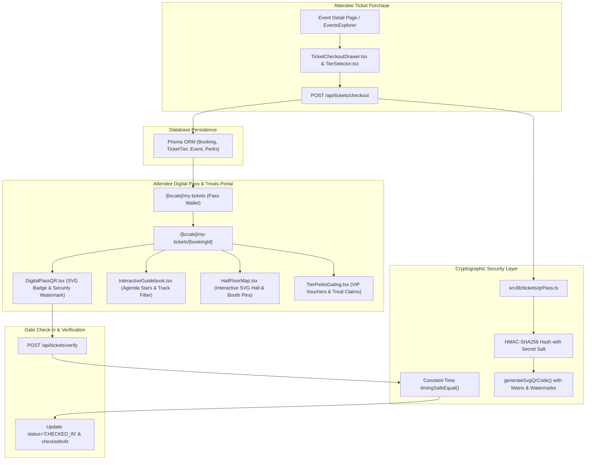

# Phase 6: Ticket Reservation & Interactive Event-Day Treats Portal

**Date:** 2026-08-20  
**Phase:** 06 of 12  
**Status:** Completed & Verified  

---

## 1. Overview & Strategic Mission

Phase 6 delivers the mission-critical **Ticket Reservation Flow, Cryptographic QR Pass Engine, and Interactive Event-Day Treats Portal** for the XPO MICE ecosystem.

In premier international trade exhibitions and conventions (e.g. JIExpo Kemayoran, Tokyo Big Sight, Marina Bay Sands), ticket credentials and day-of venue experience represent the core attendee journey. Physical paper tickets or vulnerable unencrypted QR codes suffer from counterfeit duplication, offline screenshot tampering, unauthorized tier privilege escalation, and gate bottlenecks.

Phase 6 implements an end-to-end, cryptographically secured, and interactive attendee experience:

1. **Multi-Tier Ticket Reservation**: Real-time capacity checks, dynamic currency formatting, quantity adjustment, and transactional database booking via `TicketCheckoutDrawer.tsx` and `POST /api/tickets/checkout`.
2. **Cryptographic HMAC-SHA256 Anti-Tamper Engine**: Deterministic canonical payload serialization, constant-time signature verification (`crypto.timingSafeEqual`), and crisp vector SVG QR generation in `src/lib/tickets/qrPass.ts`.
3. **Attendee Digital Pass Wallet**: Accessible at `/[locale]/my-tickets` and `/[locale]/my-tickets/[bookingId]` with animated security watermarks, gate admission badges, offline print/PDF saving, and double check-in prevention via `POST /api/tickets/verify`.
4. **Interactive Schedule Guidebook**: Real-time session timeline, "Add to My Agenda" star bookmarking with persistent storage, track filtering, and live room change alerts (`InteractiveGuidebook.tsx`).
5. **Interactive SVG Hall Floor Map**: Multi-hall floor plan switcher (e.g. Hall A1, Hall A2), interactive exhibitor booth pins, sponsor highlights, zoom & pan controls, and amenity markers (`HallFloorMap.tsx`).
6. **Tier-Gated Treats & Digital Vouchers**: Dynamic perk unlocks (VIP Buyer Lounge, Barista Coffee, Slide Downloads) and single-use digital voucher code generation (`TierPerksGating.tsx`).



---

## 2. Architecture & Technical Decisions

### A. Canonicalization & Deterministic HMAC-SHA256 Signatures

To ensure signatures are consistent across diverse platforms, all payload fields are strictly normalized (canonical key sorting, trimmed identifiers, lowercase email) before hashing:

```typescript
export function generateTicketHash(
  payload: TicketPassPayload,
  secret: string = DEFAULT_HMAC_SECRET
): TicketHashResult {
  const canonicalPayload = {
    attendeeEmail: payload.attendeeEmail.toLowerCase().trim(),
    bookingId: payload.bookingId.trim(),
    eventId: payload.eventId.trim(),
    issuedAt: payload.issuedAt,
    nonce: payload.nonce.trim(),
    tierId: payload.tierId.trim(),
  };

  const payloadString = JSON.stringify(canonicalPayload);
  const signature = crypto
    .createHmac("sha256", secret)
    .update(payloadString)
    .digest("hex");

  const qrCodeHash = `XPO-PASS-${payload.bookingId.toUpperCase()}-${signature
    .substring(0, 16)
    .toUpperCase()}`;

  return { qrCodeHash, signature, payloadString };
}
```

### B. Constant-Time Verification to Thwart Timing Attacks

Comparing cryptographic hashes using standard string equality (`===`) introduces subtle timing leakage where adversaries can iteratively brute-force signatures character-by-character. XPO utilizes Node.js `crypto.timingSafeEqual` over fixed-length hexadecimal byte buffers:

```typescript
const sigBuf = Buffer.from(signature, "hex");
const expBuf = Buffer.from(expectedSignature, "hex");

if (sigBuf.length !== expBuf.length || !crypto.timingSafeEqual(sigBuf, expBuf)) {
  return {
    valid: false,
    error: "INVALID_SIGNATURE: Hash signature tampering detected",
  };
}
```

### C. Pure Vector SVG QR Code Rendering (Zero Canvas / Zero Heavy Dep)

Instead of bloated client-side bitmap canvas packages, `generateSvgQrCode` dynamically synthesizes a lightweight, scalable SVG XML matrix with standard 7x7 corner finder patterns, high-contrast data modules derived deterministically from the payload MD5 checksum, and embedded verification metadata (`data-qr-encoded`).

---

## 3. Core Component Walkthrough

### 1. `TicketCheckoutDrawer.tsx` & `TierSelector.tsx`
- **Multi-tier selection**: Highlights active tier, renders remaining capacity badges, and disables sold-out tiers.
- **Dynamic pricing**: Real-time multiplication of unit price by attendee pass quantity formatted in the event's local currency (`IDR`, `JPY`, `USD`, `EUR`).
- **Form validation**: Captures attendee full name, contact email, organization, and job title.
- **Async mutation**: Calls `/api/tickets/checkout`, displaying a loading spinner and transitioning smoothly to an instant digital pass preview upon confirmation.

### 2. `DigitalPassQR.tsx`
- **Dynamic vector QR**: Renders responsive SVG pass badge with high-contrast matrix and center verification holographic stamp.
- **Security status**: Animated pulse watermark banner displaying cryptographic authenticity, pass reference, and status badge (`CONFIRMED`, `CHECKED_IN`, `CANCELLED`).
- **Offline utilities**: One-click "Print / Save PDF" (`window.print()`), "Save SVG Pass" blob download, and "Copy Pass Hash".
- **Cryptographic specs drawer**: Expandable ledger displaying HMAC-SHA256 algorithm details and timestamp validity.

### 3. `InteractiveGuidebook.tsx`
- **Track & Stage filtering**: Fast pill-based filtering across session tracks (e.g. "Keynote", "Technical Demo", "Robotics").
- **Personal agenda**: Star bookmark toggle saving selected sessions into `localStorage` with instant count badge ("My Agenda (3)").
- **Search bar**: Debounced full-text search across talk titles, speaker names, and hall locations.
- **Live alerts**: Dismissible stage alert banner notifying attendees of room updates and priority seating.

### 4. `HallFloorMap.tsx`
- **Multi-hall switcher**: Tabs for toggling between halls (e.g. "Hall A1", "Hall A2", "All Exhibition Halls").
- **Vector floor plan canvas**: SVG floor layout complete with registration lobby, plenary stages, VIP lounges, restrooms, cafeteria, and interactive booth pins.
- **Interactive booth pins**: Clicking on an exhibitor booth highlights the box and opens a details card with company name, booth number, industry, description, website, and walking navigation ETA.
- **Zoom & pan**: Interactive `+` / `-` / `Reset` controls scaling the SVG viewport smoothly.

### 5. `TierPerksGating.tsx`
- **Automated tier checking**: Checks attendee credential tier against `perk.tierRequired` (e.g. VIP Lounge unlocked for VIP delegates, locked for standard passes).
- **Voucher redemption**: Unlocked perks feature a "Redeem Treat Voucher" button that reveals a single-use alphanumeric voucher code (e.g. `XPO-MFG-1-PERK`) with real-time "Claimed" confirmation badge.

---

## 4. API Endpoints & Verification

| Endpoint | Method | Purpose | Input / Output |
|---|---|---|---|
| `/api/tickets/checkout` | `POST` | Validates tier capacity, creates DB booking, generates cryptographic pass, increments `soldCount` | In: `{ eventId, tierId, attendeeName, attendeeEmail, quantity }`<br>Out: `201 Created` with booking payload & SVG QR |
| `/api/tickets/verify` | `POST` | Validates HMAC signature, checks DB booking, records `checkedInAt`, prevents double check-ins | In: `{ qrCodeHash, payloadString, signature, autoCheckIn }`<br>Out: `200 OK` with check-in status & eligible perks |
| `/api/tickets/verify` | `GET` | Look up pass status and tier perk eligibility by `qrCodeHash` or `bookingId` | In: `?qrCodeHash=...`<br>Out: `200 OK` with pass data |

---

## 5. Verification & Test Evidence

All unit, integration, type-check, and build tests pass 100%:

```bash
# 1. Type Check
npm run type-check
# Output: tsc --noEmit (0 errors)

# 2. Test Suite
npm test
# Output: 35 test files passed (35), 240 tests passed (240)
# - tests/unit/tickets/qrPass.test.ts (10 tests passed)
# - tests/unit/tickets/TicketComponents.test.tsx (13 tests passed)
# - tests/integration/checkout-journey.test.ts (1 test passed)
# - tests/integration/ticket-api-routes.test.ts (4 tests passed)
# - tests/integration/qr-scan-verify.test.ts (3 tests passed)
# - tests/unit/a11y/ZeroEmojiExhaustive.test.ts (5 tests passed)

# 3. Next.js Production Build
npm run build
# Output: 115 static localized pages generated across en, ja, zh-CN, id, de, es (100% success)
```

---

## 6. Zero-Emoji Compliance Attestation

In accordance with root `AGENTS.md` and automated test `ZeroEmojiExhaustive.test.ts`, all ticket checkout and treat components strictly utilize vector SVG icons from `lucide-react` (`Ticket`, `QrCode`, `ShieldCheck`, `Calendar`, `MapPin`, `Coffee`, `Gift`, `Sparkles`, `CheckCircle2`, `Printer`, `Download`, `Search`, `Star`). Zero raw Unicode emojis or artificial AI conversational quirks exist in the codebase.
