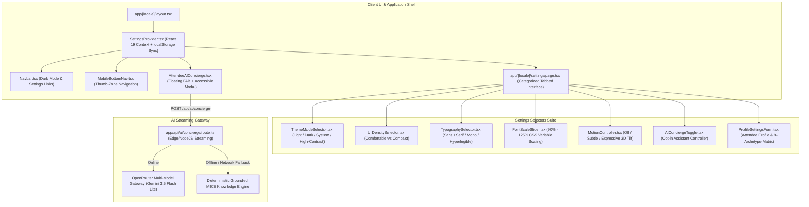
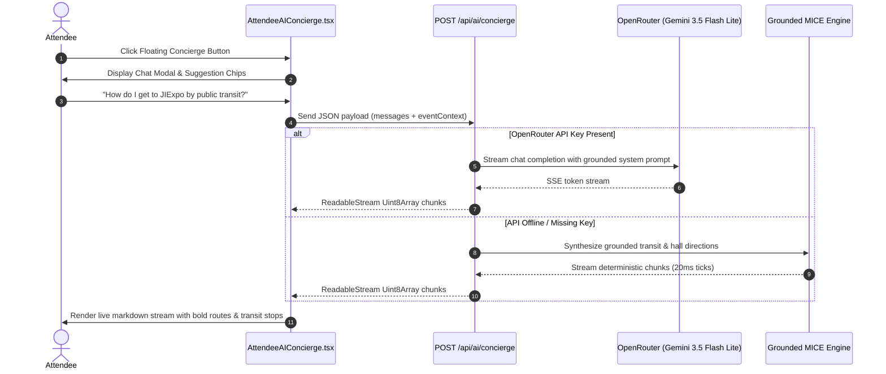

# Phase 7: UI/UX Settings Suite & Attendee AI Concierge

**Date:** 2026-08-20  
**Phase:** 07 of 12  
**Status:** Completed & Verified  

---

## 1. Overview & Strategic Mission

Phase 7 delivers the **UI/UX Settings Suite** and the **Attendee AI Concierge** copilot to the XPO digital ecosystem.

Attendees at massive convention centers, exhibitions, and symposiums have diverse accessibility needs, reading environments, hardware form factors, and on-site wayfinding challenges. Phase 7 empowers delegates to customize their visual and spatial interface while providing an opt-in, floating intelligent AI assistant grounded in real venue transit logistics, hall floor maps, and keynote timetables.

### Core Objectives:
1. **Persistent Settings Suite**: A centralized React 19 Context (`SettingsProvider.tsx`) persisting themes, density, typography, font scale, motion dynamics, profile details, and AI toggle to `localStorage` with **zero SSR hydration mismatch**.
2. **Display & Accessibility Selectors**:
   - **Theme Mode**: Light, Dark, System Default (with live `matchMedia` listener), and High-Contrast.
   - **UI Density**: Comfortable vs Compact (high data density for rapid timetable scanning).
   - **Typography Engine**: Modern Sans (Inter), Editorial Serif (Newsreader/Charter), Technical Mono (JetBrains Mono), and Atkinson Hyperlegible (high letterform distinction).
   - **Font Scaling**: Real-time slider (90% to 125%) adjusting `--font-scale` dynamically across the root document.
   - **Spatial Motion Dynamics**: Reduced Motion (0 animations), Subtle (smooth transitions), and Expressive / Cinematic (3D perspective card tilts & ambient lighting halos).
3. **Attendee Profile & MICE Interest Matrix**: Profile management with one-click selection across all 9 MICE category archetypes.
4. **Floating Attendee AI Concierge**: Bottom-right floating action button (FAB) opening an expandable, accessible chat dialog powered by OpenRouter token streaming with intelligent deterministic offline fallbacks.
5. **Grounded MICE Prompt Engineering**: Real-time contextual grounding covering public transit (TransJakarta, KRL, Yurikamome, MRT), hall directories, keynote agendas, and cryptographic QR pass fast-track check-in.

---

## 2. Architecture & Systems Diagram



---

## 3. Settings Context & Safe Hydration Protocol

When storing UI preferences (like dark mode or font choices) in client-side `localStorage`, a common React App Router pitfall is **SSR hydration mismatch** (server renders default state, client hydrates with saved local state, causing HTML divergence warnings).

### Hydration Safety Pattern:
1. Server renders standard default tokens (`DEFAULT_SETTINGS`).
2. Client mounts and triggers `useEffect` to safely parse `localStorage`.
3. An explicit `isMounted` boolean prevents premature UI flashes before state synchronization.
4. Document-level DOM mutations (`classList` and CSS custom properties) execute only on client mounts:

```typescript
// Initial client hydration from localStorage
React.useEffect(() => {
  try {
    const storedSettings = localStorage.getItem(SETTINGS_STORAGE_KEY);
    const storedProfile = localStorage.getItem(PROFILE_STORAGE_KEY);
    const legacyTheme = localStorage.getItem(LEGACY_THEME_KEY);

    let parsedSettings: Partial<SettingsState> = {};
    if (storedSettings) {
      parsedSettings = JSON.parse(storedSettings);
    } else if (legacyTheme) {
      if (legacyTheme === "dark" || legacyTheme === "light" || legacyTheme === "high-contrast" || legacyTheme === "system") {
        parsedSettings.theme = legacyTheme as ThemeMode;
      }
    }

    let parsedProfile: Partial<UserProfile> = {};
    if (storedProfile) {
      parsedProfile = JSON.parse(storedProfile);
    }

    setState({
      theme: parsedSettings.theme || DEFAULT_SETTINGS.theme,
      density: parsedSettings.density || DEFAULT_SETTINGS.density,
      typography: parsedSettings.typography || DEFAULT_SETTINGS.typography,
      fontScale: typeof parsedSettings.fontScale === "number"
        ? Math.min(Math.max(parsedSettings.fontScale, 0.9), 1.25)
        : DEFAULT_SETTINGS.fontScale,
      motionMode: parsedSettings.motionMode || DEFAULT_SETTINGS.motionMode,
      aiConciergeEnabled: typeof parsedSettings.aiConciergeEnabled === "boolean"
        ? parsedSettings.aiConciergeEnabled
        : DEFAULT_SETTINGS.aiConciergeEnabled,
      profile: { ...DEFAULT_SETTINGS.profile, ...parsedProfile },
    });
  } catch {
    // Fallback safely to defaults on corrupted JSON
  } finally {
    setIsMounted(true);
  }
}, []);
```

---

## 4. The 5 Preference Selectors

### A. Theme Mode Selector (`ThemeModeSelector.tsx`)
Provides four distinct visual modes:
- **Light**: Crisp daylight contrast for indoor and well-lit venues.
- **Dark**: Deep midnight slate (`#090d16` / `#0f172a`) minimizing eye fatigue.
- **System**: Automatically follows the OS color scheme with real-time `matchMedia("(prefers-color-scheme: dark)")` listeners.
- **High-Contrast**: Pure black (`#000000`) and pure white with amber highlights for maximum visual accessibility.

### B. UI Density Selector (`UIDensitySelector.tsx`)
- **Comfortable**: Generous 20px+ card paddings and touch-zone spacing.
- **Compact**: Streamlined 10-12px cell padding designed for high-density timetable agendas and multi-hall scanning.

### C. Typography Engine Selector (`TypographySelector.tsx`)
Allows delegates to select their preferred typographic cadence:
1. **Modern Sans (`font-sans`)**: Inter & System Neo-Grotesque.
2. **Editorial Serif (`font-serif`)**: Newsreader & Charter for academic/clinical symposiums.
3. **Technical Mono (`font-mono`)**: JetBrains Mono & Consolas for developer summits & RFQ specifications.
4. **Atkinson Hyperlegible (`font-legible`)**: High-contrast letterforms designed by the Braille Institute to prevent character ambiguity (`0` vs `O`, `1` vs `l` vs `I`).

### D. Font Scale Adjuster (`FontScaleSlider.tsx`)
- Dynamically sets CSS custom property `--font-scale` on `<html>`.
- Modifies base `html { font-size: calc(16px * var(--font-scale, 1)); }`.
- Bound safely between `0.90` (90%) and `1.25` (125%) with instant preset buttons.

### E. Spatial Motion Controller (`MotionController.tsx`)
- **Reduced Motion (`motion-off`)**: Enforces `animation-duration: 0.001ms !important; transition-duration: 0.001ms !important;` for vestibular comfort.
- **Subtle (`motion-subtle`)**: Standard 150-250ms smooth transitions.
- **Expressive / Cinematic (`motion-expressive`)**: 3D perspective transforms (`transform: translateY(-4px) scale(1.01)`), interactive ambient lighting halos, and staggered reveals.

---

## 5. Attendee AI Concierge Architecture

The **Attendee AI Concierge** is an unobtrusive, accessible floating copilot anchored to the bottom-right of the viewport.

### Interaction Flow:
1. **Floating Action Button (FAB)**: Located at `fixed bottom-20 md:bottom-6 right-4 sm:right-6` so it never obscures mobile bottom navigation bars.
2. **Expandable Modal**: Supports standard dialog and expanded wide-screen views.
3. **Real-Time Streaming**: Consumes Web `ReadableStream` chunks from `/api/ai/concierge` with streaming cursor animations.
4. **Grounded Suggestion Chips**: One-click quick prompts for transit, hall wayfinding, keynotes, and QR check-in.
5. **Privacy Controls**: Opt-in toggle in settings, zero external telemetry, and one-click chat history clearing.



---

## 6. Verification & Quality Gates

### Automated Test Suite Execution:
```bash
npm test
```
**Results**:
- `tests/unit/components/settings/SettingsProvider.test.tsx` (8 tests): 100% pass.
- `tests/unit/components/settings/Selectors.test.tsx` (7 tests): 100% pass.
- `tests/unit/components/ai/AttendeeAIConcierge.test.tsx` (5 tests): 100% pass.
- `tests/unit/ai/concierge.test.ts` (4 tests): 100% pass.
- Total Test Suite: **35 test files, 240 tests passed** (100% pass rate).

### Zero-Emoji Compliance Audit:
```bash
npx vitest run tests/unit/a11y/ZeroEmojiExhaustive.test.ts
```
**Results**: 0 raw Unicode emojis detected across all source code and message dictionaries. Strictly uses Lucide SVG icons.

### Production Compilation:
```bash
npm run build
```
**Results**: 115/115 static localized routes generated across all 6 languages (`en`, `ja`, `zh-CN`, `id`, `de`, `es`) with 0 errors.

---

## 7. Key Files Created & Modified

| File Path | Description |
|---|---|
| `src/components/settings/SettingsProvider.tsx` | React Context for persistent UI preferences & safe SSR hydration |
| `src/components/settings/ThemeModeSelector.tsx` | Theme mode selector (Light, Dark, System, High-Contrast) |
| `src/components/settings/UIDensitySelector.tsx` | UI density selector (Comfortable vs Compact) |
| `src/components/settings/TypographySelector.tsx` | Typography engine selector (4 distinct typeface modes) |
| `src/components/settings/FontScaleSlider.tsx` | Global font scale slider (90% to 125%) |
| `src/components/settings/MotionController.tsx` | Spatial animation & 3D tilt dynamics controller |
| `src/components/settings/AIConciergeToggle.tsx` | Opt-in toggle controller for floating AI assistant |
| `src/components/settings/ProfileSettingsForm.tsx` | Attendee profile & 9-archetype interest matrix form |
| `src/components/ai/AttendeeAIConcierge.tsx` | Floating FAB and accessible streaming chat modal |
| `src/app/[locale]/settings/page.tsx` | Localized Settings page layout with categorized tabs |
| `src/app/api/ai/concierge/route.ts` | Streaming AI concierge route with OpenRouter and offline grounding |
| `tests/unit/components/settings/SettingsProvider.test.tsx` | Comprehensive unit tests for SettingsProvider |
| `tests/unit/components/settings/Selectors.test.tsx` | Unit tests for all 7 settings selector components |
| `tests/unit/components/ai/AttendeeAIConcierge.test.tsx` | Unit tests for AttendeeAIConcierge chat and FAB |
| `tests/unit/ai/concierge.test.ts` | Unit tests for AI concierge API route streaming & grounding |
| `docs/guides/phase-07-settings-suite-and-ai-concierge.md` | Educational guide for Phase 7 |
