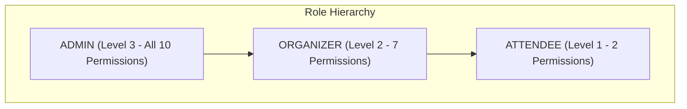
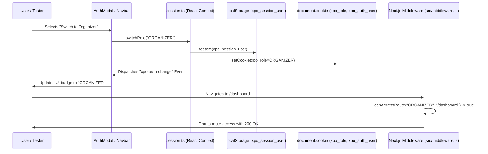

# Phase 8: Multi-Role RBAC, Authentication & Security Governance

**Date:** 2026-08-21  
**Phase:** 08 of 12  
**Status:** Completed & Verified  

---

## 1. Overview & Security Architecture

Phase 8 introduces enterprise-grade **Role-Based Access Control (RBAC)**, session management, and role-persona simulation to the XPO digital ecosystem.

In a multi-sided MICE ecosystem, the platform accommodates three primary user archetypes:
1. **Attendee & Buyer (`ATTENDEE`)**: Explores scheduled conventions, purchases passes, unlocks perks, and navigates hall maps.
2. **Event Organizer (`ORGANIZER`)**: Creates exhibitions, manages booth rosters, configures real-time visual branding customizers, performs door QR check-ins, and generates AI analytics reports.
3. **Platform Administrator (`ADMIN`)**: Governs venue directories, manages hall indexing, triggers automated scraper pipelines, and reviews system audit logs.

### Core Objectives:
1. **Granular RBAC Engine (`src/lib/auth/rbac.ts`)**: Strict 10-permission matrix, route accessibility rules, and hierarchical privilege tiers (`ADMIN: 3`, `ORGANIZER: 2`, `ATTENDEE: 1`).
2. **Persistent Session Context (`src/lib/auth/session.ts`)**: Synchronized session state across React 19 Context, `localStorage`, and HTTP cookies (`xpo_role`, `xpo_auth_user`) for unified SSR and client-side authorization.
3. **Interactive Authentication Dialog (`src/components/auth/AuthModal.tsx`)**:
   - One-click Persona Switcher (Attendee, Organizer, Admin) with live permission badges.
   - Credentials sign-in tab with simulated authentication and auto-fill helpers.
   - Granular RBAC Permissions Matrix reference table with 100% vector SVG icons.
4. **Header & Navigation Integration (`src/components/layout/Navbar.tsx` & `Header.tsx`)**: Active user display with dynamic role badges, avatar initials, and quick modal triggers.
5. **Route Protection Middleware (`src/middleware.ts`)**: Seamless request interception evaluating `canAccessRoute(role, pathname)` and attaching security headers.

---

## 2. RBAC Permission Matrix & Hierarchy

| Permission ID | Description | Category | ATTENDEE | ORGANIZER | ADMIN |
|---|---|---|:---:|:---:|:---:|
| `events:view` | View and search MICE events & timetables | Attendee & Discovery | Yes | Yes | Yes |
| `tickets:buy` | Reserve passes & generate cryptographic QR | Attendee & Discovery | Yes | Yes | Yes |
| `tickets:verify` | Door staff QR check-in & double-scan check | Organizer Tools | No | Yes | Yes |
| `events:create` | Multi-step event creation wizard | Organizer Tools | No | Yes | Yes |
| `events:edit` | Live branding customizer & theme overrides | Organizer Tools | No | Yes | Yes |
| `booths:manage` | Booth allocation & exhibitor directory | Organizer Tools | No | Yes | Yes |
| `ai:reports` | Multi-model OpenRouter executive reports | Organizer Tools | No | Yes | Yes |
| `venues:manage` | World-class venue & hall directory governance | Governance | No | No | Yes |
| `crawler:run` | Automated venue schedule crawler pipeline | Governance | No | No | Yes |
| `audit:view` | System audit logs & security telemetry | Governance | No | No | Yes |



---

## 3. Session Synchronization & Cookie Architecture

To allow seamless collaboration between client components, server components, and Next.js Edge middleware without hydration flash, the session engine uses a dual-write mechanism:



---

## 4. Key Implementation Patterns

### 4.1 Route Authorization Guard
```typescript
export function canAccessRoute(role: UserRole | string, pathname: string): boolean {
  if (!isValidRole(role)) return false;

  if (pathname.startsWith("/admin") || pathname.includes("/(admin)/")) {
    return role === "ADMIN";
  }

  if (
    pathname.startsWith("/organizer") ||
    pathname.includes("/(organizer)/") ||
    pathname.includes("/dashboard") ||
    pathname.includes("/events/new") ||
    pathname.includes("/customizer") ||
    pathname.includes("/booths") ||
    pathname.includes("/scanner")
  ) {
    return role === "ORGANIZER" || role === "ADMIN";
  }

  return true;
}
```

### 4.2 Cross-Component Event Dispatch
When a role switch occurs, a custom browser event `xpo-auth-change` triggers instant synchronization across the Navbar, active drawers, and role guard gates without full page reloads:
```typescript
export function setStoredUser(user: AuthUser | null): void {
  if (typeof window === "undefined") return;

  if (user) {
    localStorage.setItem(STORAGE_KEY_USER, JSON.stringify(user));
    document.cookie = `${COOKIE_NAME_ROLE}=${user.role}; path=/; max-age=${60 * 60 * 24 * 30}; SameSite=Lax`;
  }
  window.dispatchEvent(new CustomEvent("xpo-auth-change", { detail: user }));
}
```

---

## 5. Verification & Testing

The Phase 8 implementation is validated via automated test suites covering:
1. **Permission Matrix Adherence**: Validating that `ATTENDEE`, `ORGANIZER`, and `ADMIN` roles strictly match their authorized capability sets.
2. **Route Authorization Checks**: Confirming that unauthorized roles are blocked from accessing protected routes (`/admin`, `/dashboard`, `/scanner`).
3. **Privilege Elevation Boundaries**: Verifying that organizers cannot trigger scraper crawlers or manage platform-wide venue directories.
4. **Session Persistence**: Testing role cookie setting and local state synchronization.

---

## 6. Next Steps & Phase 9 Integration

With RBAC and session simulation securely in place, Phase 9 builds upon these foundations to deliver the **Organizer Portal**:
- Event Creation Wizard with multi-step validation.
- Real-time side-by-side Visual Branding Customizer.
- Hall Booth & Tenant Manager.
- Cryptographic Door Staff QR Check-In Scanner.
