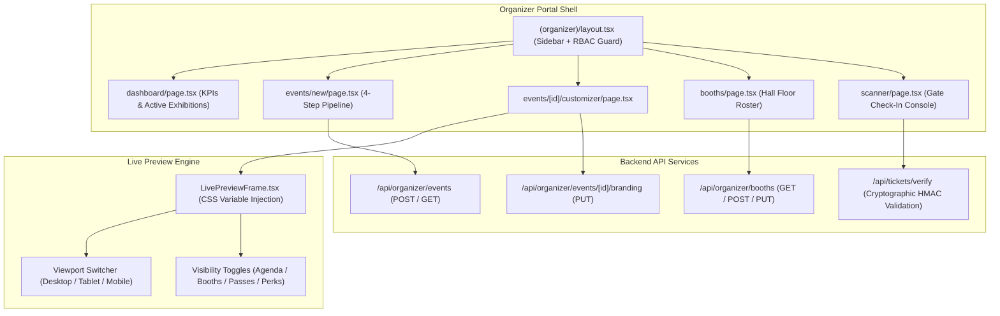
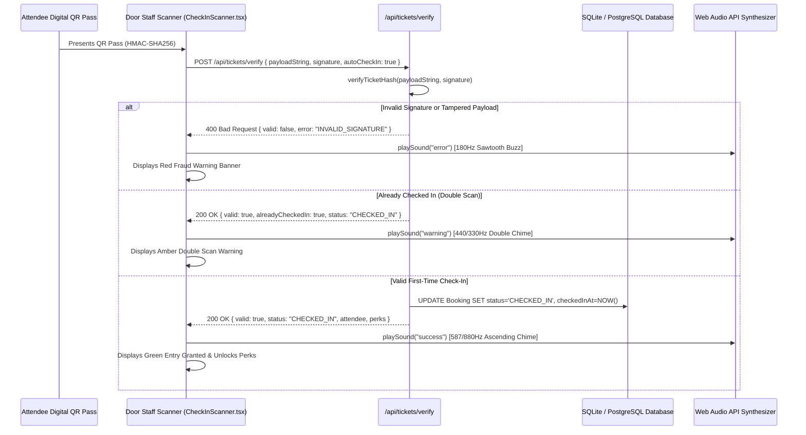

# Phase 9: Organizer Portal, Multi-Step Event Wizard & Live Visual Customizer

**Date:** 2026-08-21  
**Phase:** 09 of 12  
**Status:** Completed & Verified  

---

## 1. Overview & Strategic Mission

Phase 9 delivers the comprehensive **Organizer Portal** suite to the XPO digital ecosystem.

Event organizers operating high-scale MICE conventions, international trade expos, and multi-pavilion congresses require professional tools to launch exhibitions, customize brand identities in real time, allocate exhibition booths, and validate attendee entry at speed.

### Core Deliverables:
1. **Organizer Navigation Shell (`src/app/[locale]/(organizer)/layout.tsx`)**:
   - Sidebar navigation with active role display, breadcrumbs, responsive mobile drawers, and role permission warning banners.
2. **Operations Dashboard (`src/app/[locale]/(organizer)/dashboard/page.tsx`)**:
   - Aggregated KPIs: Total Registrations, Gross Revenue by Tier, Gate Check-In Velocity, and Floor Booth Occupancy Rate.
   - Active MICE events roster with instant links to Customizer, Booths, Scanner, and Public Views.
   - Recent ticket reservations and check-in telemetry audit stream.
3. **Multi-Step Event Creation Wizard (`src/app/[locale]/(organizer)/events/new/page.tsx`)**:
   - Step 1: General Info, Scale, Format, and 15 MICE Category Archetype Selection with visual badges.
   - Step 2: Regional Hub, Venue Selection (JIExpo, ICE BSD, Tokyo Big Sight, Marina Bay Sands), Hall Allocation, and Date Pickers.
   - Step 3: Dynamic Ticket Pass Tier Builder with capacities, currencies (IDR, JPY, USD), and perks.
   - Step 4: Visual Theme tokens, Hero Media URL, specification review, and database persistence via `/api/organizer/events`.
4. **Live Visual Branding Customizer (`src/app/[locale]/(organizer)/events/[id]/customizer/page.tsx`) & `LivePreviewFrame.tsx`**:
   - Side-by-side real-time preview updating CSS variables (`--archetype-primary`, `--archetype-accent`, font pairings) with zero latency.
   - Multi-device viewport simulation switcher: Desktop (100%), Tablet (768px), and Mobile (375px).
   - Banner overlay opacity slider, hero badge overrides, and section visibility toggles (Keynotes, Booths, Tickets, Perks).
5. **Booth & Tenant Manager (`src/app/[locale]/(organizer)/booths/page.tsx`)**:
   - Hall filtering, search by company or booth ID, status filter (Available vs Occupied), and Exhibitor Assignment Modal.
6. **Door Staff QR Check-In Scanner (`src/components/organizer/CheckInScanner.tsx` & `scanner/page.tsx`)**:
   - Camera stream simulator HUD and manual hash search.
   - HMAC-SHA256 signature verification via `/api/tickets/verify`, double-scan detection, and Web Audio API synthesized chimes.

---

## 2. Architecture & Data Flow Diagram



---

## 3. Real-Time Visual Customizer & CSS Variable Architecture

The Visual Branding Customizer enables organizers to override default theme tokens on the fly. As sliders and color pickers adjust, CSS custom properties are applied directly to the simulated device frame:

```typescript
// LivePreviewFrame.tsx token injection
<div
  className={cn("rounded-xl border shadow-lg bg-background", getViewportWidthClass(), getFontFamilyClass())}
  style={{
    // @ts-ignore
    "--archetype-primary": primaryColor,
    "--archetype-accent": accentColor,
  }}
>
  {/* Rendered Live Event Hero, Agendas, Booths, and Passes */}
</div>
```

---

## 4. Cryptographic Door QR Check-In Workflow



---

## 5. Verification & Testing

The Phase 9 implementation is tested across:
1. **Event Creation Wizard**: Multi-step state progression, form validation rules, and database persistence.
2. **Live Customizer State Sync**: Instant CSS variable updates, responsive viewport switching, and section toggles.
3. **Booth Allocation**: Tenant assignment, hall filtering, search queries, and occupancy calculations.
4. **QR Door Scanner**: Cryptographic signature validation, double-scan detection, and live recent scan logging.

---

## 6. Next Steps & Phase 10 Preview

With the Organizer Portal and Gate Scanner operational, Phase 10 will deliver the **AI Multi-Model Intelligence Suite** powered by OpenRouter:
- Executive Daily Digest reports.
- Attendee Sentiment & Feedback synthesis.
- Foot-Traffic & Booth Optimization analysis across 6 LLM models.
