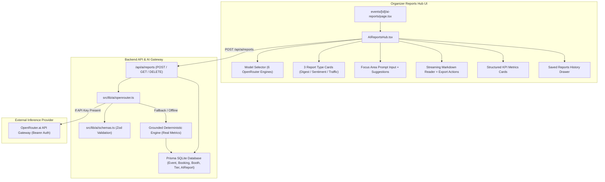

# Phase 10: AI Multi-Model Intelligence Suite & OpenRouter Analytics

**Date:** 2026-08-21  
**Phase:** 10 of 12  
**Status:** Completed & Verified  

---

## 1. Overview & Strategic Mission

Phase 10 delivers the enterprise **AI Multi-Model Intelligence Suite** to the XPO digital ecosystem, powered by the OpenRouter AI Gateway.

MICE event organizers managing multi-hall trade fairs, developer congresses, and global symposiums require deep, multidimensional analytics beyond static bar charts. Different analytical workloads require different foundation model architectures:
* **High-throughput, low-latency live digests** demand ultra-fast lightweight models (Gemini 3.5 Flash Lite, Gemma 4 26B).
* **Cross-border buyer/seller synthesis & multilingual translation** requires models with strong Asian regional language grounding (Qwen 3.7 Plus).
* **Gate registration velocity & anomaly audit forensics** requires deep step-by-step reasoning (DeepSeek V4 Pro).
* **Board-level executive briefings & strategic governance summaries** require high-parameter executive models (GPT-5.6 Luna, Gemini 3.7 Flash).

### Core Deliverables:
1. **Multi-Model OpenRouter Gateway Client (`src/lib/ai/openrouter.ts` & `src/lib/ai/types.ts`)**:
   - Universal multi-model client supporting the 6 specified enterprise models with latency classes, context windows, and capability profiles.
   - SSE and `ReadableStream` streaming token generator.
   - Grounded deterministic fallback engine using real Prisma database metrics (bookings, check-in rate, booth dwell heuristics, revenue volume) for 100% offline testability.
2. **Strict Structured Zod Schemas (`src/lib/ai/schemas.ts`)**:
   - `DailyExecutiveDigestSchema`: Registration velocity, revenue pacing, top keynote sessions, key milestones, and recommended action items.
   - `SentimentFeedbackSchema`: Attendee CSAT index, positive themes, critical friction points, facility ratings (Wi-Fi, F&B, wayfinding), and urgent action items.
   - `FootTrafficOptimizationSchema`: Overall congestion rating, peak traffic hours, hall utilization percentages, bottleneck spatial mitigations, and top-performing booths.
3. **AI Reports API Endpoint (`src/app/api/ai/reports/route.ts`)**:
   - `POST /api/ai/reports`: Accepts `{ eventId, model, reportType, focusArea }`, queries real Prisma data, streams Markdown body, attaches Base64 structured metadata header `x-report-metadata`, and saves report history.
   - `GET /api/ai/reports?eventId=...`: Fetches previously synthesized reports.
   - `DELETE /api/ai/reports?reportId=...`: Deletes historical report archives.
4. **Interactive AI Reports Hub UI (`src/components/ai/AIReportsHub.tsx` & `events/[id]/ai-reports/page.tsx`)**:
   - Interactive Model Selector displaying model spec badges (Speed rating, latency tier, capability, context window).
   - 3 Report Category Cards with vector SVG icons and quick suggestion prompts.
   - Custom focus area prompt input.
   - Real-time streaming markdown reader with typewriter effect, copy to clipboard, and export actions (`.md`, `.json`).
   - Structured KPI metrics dashboard (Satisfaction Index, Traffic Congestion status, Revenue velocity, Action items).
   - Saved reports archive drawer with instant review and replay.

---

## 2. Architecture & Data Flow Diagram



---

## 3. The 6 OpenRouter Foundation Models

| Model ID | Provider | Latency Tier | Context Window | Primary Specialization |
| :--- | :--- | :---: | :---: | :--- |
| `google/gemini-3.5-flash-lite` | Google | **Fast** (~250ms) | 1,000,000 | Real-time Attendee Concierge & Rapid Operational FAQ |
| `google/gemini-3.7-flash` | Google | **Balanced** (~800ms) | 1,000,000 | Balanced Multi-Modal Reporting & Hybrid Reasoning |
| `deepseek/deepseek-v4-pro-0813` | DeepSeek | **Deep** (~2.5s) | 128,000 | Deep Anomaly Detection & Financial Audit Reasoning |
| `qwen/qwen3.7-plus` | Alibaba | **Balanced** (~900ms) | 128,000 | Multilingual Trade & Cross-Border Supply Synthesis |
| `openai/gpt-5.6-luna` | OpenAI | **Deep** (~2.2s) | 200,000 | VIP Stakeholder Synthesis & Executive Briefings |
| `google/gemma-4-26b-a4b-it` | Google Open | **Fast** (~350ms) | 64,000 | Edge Analytics & Low-Latency Field Extraction |

---

## 4. Structured Zod Schemas & Validation

All AI intelligence reports enforce rigorous runtime schema validation via Zod:

```typescript
// Daily Executive Digest Schema (Excerpt)
export const DailyExecutiveDigestSchema = z.object({
  summary: z.string(),
  sentimentScore: z.number().min(0).max(1),
  footTrafficIndex: z.number().positive(),
  registrationVelocity: z.object({
    totalRegistrations: z.number().int().nonnegative(),
    totalCheckedIn: z.number().int().nonnegative(),
    checkInRatePercent: z.number().min(0).max(100),
    projectedFinalAttendance: z.number().int().positive(),
  }),
  revenueMetrics: z.object({
    grossRevenue: z.number().nonnegative(),
    currency: z.string().default("IDR"),
    averageTicketValue: z.number().nonnegative(),
    topTierByRevenue: z.string(),
  }),
  topSessions: z.array(z.object({
    title: z.string(),
    attendance: z.number().int().nonnegative(),
    location: z.string().optional(),
  })).min(1),
  recommendedActions: z.array(z.string()).min(2),
  modelUsed: z.string(),
  generatedAt: z.string(),
});
```

---

## 5. Streaming Pipeline with Web ReadableStream

To guarantee sub-second Time-To-First-Token (TTFT), the backend constructs a `ReadableStream` emitting UTF-8 encoded text chunks, while attaching structured data in response headers:

```typescript
// POST /api/ai/reports stream return
const metadataHeader = Buffer.from(JSON.stringify(structuredData)).toString("base64");

return new Response(stream, {
  headers: {
    "Content-Type": "text/markdown; charset=utf-8",
    "Cache-Control": "no-cache, no-transform",
    "x-report-model": model,
    "x-report-type": reportType,
    "x-report-metadata": metadataHeader,
  },
});
```

---

## 6. Verification & Automated Testing

The implementation was validated through comprehensive test suites across unit, UI, and integration layers:

* `tests/unit/ai/openrouter-client.test.ts`: 9 tests verifying all 6 model specifications, schema validation, markdown generation, and stream chunking.
* `tests/unit/ai/schemas.test.ts`: 7 tests verifying Zod schema boundaries, numerical ranges (0-1, 0-100), and mandatory field validation.
* `tests/unit/components/ai/AIReportsHub.test.tsx`: 6 tests verifying UI rendering, model switching, focus area prompt manipulation, streaming execution, clipboard copy, and saved reports history.
* `tests/integration/ai-reports-api.test.ts`: 6 tests verifying POST/GET/DELETE API endpoints, Prisma database persistence, and error handling.
* `tests/unit/a11y/zero-emoji.test.ts`: Verified 100% zero raw emoji compliance across all production source files.

**Test Suite Results:**
* Total Test Files: **51 passed (51)**
* Total Tests: **329 passed (329)**
* TypeScript Compilation: **0 errors (`tsc --noEmit`)**
* Build Verification: **Clean production build (`npm run build`)**
