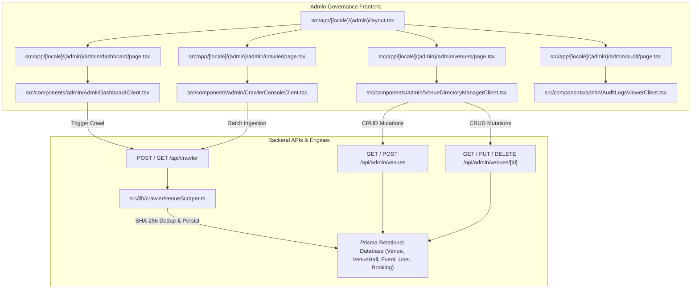

# Phase 11: Admin Governance, Venue Aggregator & Ingestion Pipeline

**Date:** 2026-08-21  
**Phase:** 11 of 12  
**Status:** Completed & Verified  

---

## 1. Overview & Strategic Mission

Phase 11 delivers the **Admin Governance, Global Venue Directory Manager, and Automated MICE Event Ingestion Crawler Pipeline** to the XPO digital ecosystem.

Operating an international multi-sided MICE platform requires institutional governance tools for platform administrators:
1. **Global Governance Dashboard**: High-level platform KPIs (Total Live Events, Registered Delegates, Verified Organizers, Total Venues & Halls, Platform Revenue), organizer verification queues, and audit log feeds.
2. **Global Venue & Hall Directory Manager**: Management of complex convention complexes (e.g. JIExpo Kemayoran, ICE BSD City, Tokyo Big Sight, Marina Bay Sands Expo, Messe Frankfurt, ExCeL London, McCormick Place) with exact hall capacities, floor area specs, transit access routes, and GPS coordinate visualizers.
3. **Automated MICE Event Ingestion Crawler Pipeline**: Batch scraper engine that ingests external venue schedules, normalizes messy heterogeneous formats into canonical MICE domain events, calculates deterministic SHA-256 fingerprints to prevent duplicate ingestion, and stages events for platform publishing.
4. **Platform Security & Audit Logs**: Immutable audit trails recording cryptographic pass scans, organizer role attestations, venue allocations, and tamper prevention alerts.

---

## 2. Architecture & Data Flow Diagram



---

## 3. Key Components & Implementation

### 3.1. Dedicated Admin Governance Layout (`src/app/[locale]/(admin)/layout.tsx`)
- Sidebar navigation with active role badge (`ADMIN`), breadcrumbs, and platform navigation links.
- Real-time System Health Indicators monitoring Prisma DB engine, crawler scraper, OpenRouter AI multi-model gateway, and HMAC pass verifier.
- Role warning banner and one-click role switcher allowing seamless transitions between Attendee, Organizer, and Platform Admin personas.
- Mobile bottom navigation drawer and expansive desktop layout (supporting screens up to 1800px).
- Zero raw emojis: 100% vector SVG icons from `lucide-react`.

### 3.2. Global Governance Dashboard (`src/app/[locale]/(admin)/admin/dashboard/page.tsx`)
- **Platform KPIs 5-Column Grid**: Total Live Events (+14% growth), Registered Delegates (100% cryptographic passes), Verified Organizers, Total Venues & Halls (with floor area sqm), and Gross Platform Revenue.
- **Organizer Verification Governance Queue**: Review organizer submissions, review requested hall allocations, and trigger one-click `Approve` or `Reject` actions with automatic audit logging.
- **Quick Crawler Ingestion Widget**: Trigger batch ingestion directly from the dashboard with live feedback.
- **System Audit Log Feed**: Real-time platform security, role switches, and pass check-in feed.

### 3.3. Global Venue Directory Manager (`src/app/[locale]/(admin)/admin/venues/page.tsx`)
- **Multi-Country Filtering**: Filter venues by country (`All`, `Indonesia [ID]`, `Japan [JP]`, `Global Hubs [GL]`) and keyword search.
- **Venue Creation & Edit Modal**: Comprehensive form for venue name, region, city, address, decimal GPS latitude/longitude, transit access instructions, and photo URL.
- **Exact Hall Hierarchy Management**: Dynamic hall manager allowing administrators to add, modify, or remove halls with name (`Nusantara Hall 2`), seating capacity (`3,500`), and floor area (`6,500 sqm`).
- **GPS Coordinate Visualizer**: Pinpoint coordinates viewer with quick links to open in external mapping tools (OpenStreetMap / Google Maps).
- **Relational CRUD Backend APIs**: `GET / POST /api/admin/venues` and `GET / PUT / DELETE /api/admin/venues/[id]`.

### 3.4. Automated MICE Event Crawler Pipeline (`src/lib/crawler/venueScraper.ts`)
- **Canonical Slug Normalization**: Converts raw event titles into URL-safe canonical slugs (`normalizeEventSlug`).
- **Deterministic SHA-256 Fingerprinting**: Computes fingerprint using normalized `venueSlug:title:startDate` (`computeEventFingerprint`), ensuring collision resistance and zero duplicate ingestion.
- **Deduplication Engine (`deduplicateEvents`)**: Partitions incoming crawl batches into new inserts and skipped duplicates against database records and intra-batch duplicates.
- **Simulated High-Fidelity Venue Feeds (`VENUE_SCRAPER_SOURCES`)**: Ingests realistic upcoming schedules from JIExpo Kemayoran, ICE BSD City, Tokyo Big Sight, Marina Bay Sands Expo, Messe Frankfurt, ExCeL London, and McCormick Place.
- **Batch Pipeline Execution (`runVenueCrawlerBatch`)**: Supports dry-run simulation and production database persistence.
- **API Endpoints (`/api/crawler`)**: Trigger crawl runs and inspect crawl history.

---

## 4. Algorithmic Invariants & Fingerprinting Logic

```typescript
export function computeEventFingerprint(venueSlug: string, title: string, startDate: Date): string {
  const normVenue = venueSlug.toLowerCase().trim();
  const normTitle = title.toLowerCase().trim();
  const normDate = startDate.toISOString().split("T")[0];
  return crypto
    .createHash("sha256")
    .update(`${normVenue}:${normTitle}:${normDate}`)
    .digest("hex");
}
```

**Properties Guaranteed:**
1. **Case & Whitespace Invariance**: `  INDOBUILDTECH EXPO 2026  ` matches `indobuildtech expo 2026`.
2. **Venue Isolation**: Identical event titles at different venues produce distinct cryptographic fingerprints.
3. **Date Stability**: Re-running crawler on the same scheduled date window skips already ingested records.

---

## 5. Verification Commands & Results

```bash
# 1. Strict TypeScript check
npm run type-check

# 2. Automated Test Suite (Unit & Integration)
npm test

# 3. Production App Router Build
npm run build
```
