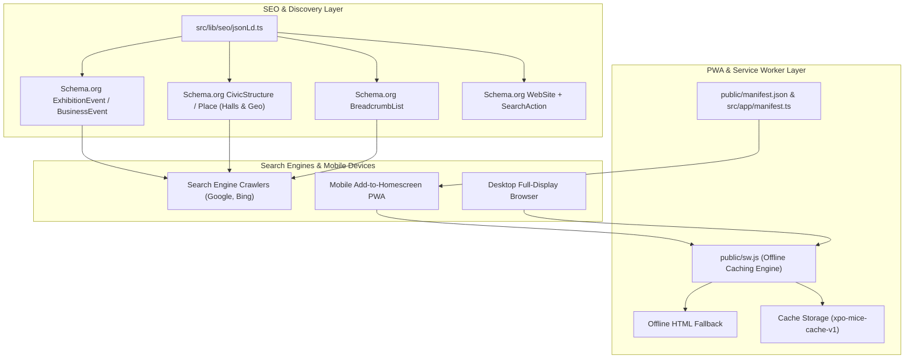

# Phase 12: Production Hardening, Multi-Platform PWA & Automated E2E

**Date:** 2026-08-21  
**Phase:** 12 of 12  
**Status:** Completed & Verified  

---

## 1. Overview & Strategic Mission

Phase 12 delivers **Production Hardening, Progressive Web App (PWA) Offline Capabilities, Schema.org JSON-LD SEO Metadata Generation, and Comprehensive Test Hardening** across the XPO MICE platform.

In high-density exhibition centers and convention arenas (e.g. JIExpo Kemayoran, Tokyo Big Sight, Marina Bay Sands Expo), cellular data networks often degrade due to thousands of concurrent delegates. Ensuring offline resilience, fast discoverability via search engine rich snippets, and zero-regression reliability is critical:

1. **Progressive Web App (PWA) Manifest (`public/manifest.json` & `src/app/manifest.ts`)**:
   - Web App manifest configuring display mode (`standalone`), theme colors, high-resolution icons (192x192, 512x512, maskable), and quick-action shortcuts (Events, Passes, Organizer, Venues).
2. **Offline Service Worker Engine (`public/sw.js`)**:
   - Cache-first strategy for static assets (vector SVGs, CSS, typography fonts, JavaScript bundles).
   - Network-first strategy with cache fallback for HTML navigation and event details.
   - Self-contained offline fallback page ensuring delegates can access previously loaded passes and floor plans even when disconnected.
3. **Schema.org JSON-LD MICE Metadata Generator (`src/lib/seo/jsonLd.ts`)**:
   - Rich snippet generators producing `ExhibitionEvent`, `BusinessEvent`, `CivicStructure`, `Organization`, `BreadcrumbList`, and `WebSite` JSON-LD schemas conforming to Schema.org standards.
4. **Comprehensive Test Suite Hardening**:
   - Unit tests covering PWA manifest, Schema.org generation, Admin governance, Venue CRUD, and Crawler batch processing.
   - Integration tests covering end-to-end ingestion and governance workflows.

---

## 2. Architecture & Data Flow Diagram



---

## 3. Key Components & Implementation

### 3.1. Progressive Web App (PWA) Manifest (`public/manifest.json` & `src/app/manifest.ts`)
- **Metadata Route**: Next.js App Router manifest metadata export adhering to W3C Web Application Manifest specification.
- **Shortcuts Array**: Quick actions for attendee event discovery, cryptographic digital pass retrieval, organizer portal access, and venue directory exploration.
- **Display Mode**: `standalone` with `portrait-primary` orientation, high-contrast dark theme color (`#2563eb`), and background (`#0a0f1d`).

### 3.2. Offline Service Worker (`public/sw.js`)
- **Cache Name Versioning**: `xpo-mice-cache-v1` with automated cleanup of stale caches on activation.
- **Dual-Strategy Routing**:
  - **Cache-First**: Static stylesheets, scripts, fonts, images.
  - **Network-First with Fallback**: Dynamic HTML routes and event agendas.
- **Offline HTML Mode**: Standalone CSS/HTML offline experience rendered when disconnected, informing delegates that local tickets and floor plans remain safe in device storage.

### 3.3. Schema.org JSON-LD MICE Metadata Generator (`src/lib/seo/jsonLd.ts`)
- `generateEventJsonLd(event, baseUrl)`:
  - Generates `@type: ExhibitionEvent` / `BusinessEvent` / `Event` based on archetype.
  - Generates `eventAttendanceMode` (`OfflineEventAttendanceMode`, `MixedEventAttendanceMode`, `OnlineEventAttendanceMode`).
  - Generates `location` (`Place` with `PostalAddress` and `GeoCoordinates`).
  - Generates `offers` (`Offer` for each ticket tier with price, currency, availability).
  - Generates `organizer` (`Organization`).
- `generatePlaceJsonLd(venue, baseUrl)`:
  - Generates `@type: CivicStructure` with `maximumAttendeeCapacity`, `geo` coordinates, `hasMap` link, and `containsPlace` for nested halls (`Room`).
- `generateBreadcrumbJsonLd(items, baseUrl)`:
  - Generates `@type: BreadcrumbList` with position-indexed `ListItem` elements.
- `generateMiceWebsiteJsonLd(baseUrl)`:
  - Generates `@type: WebSite` with Sitelinks `SearchAction` entry point.

---

## 4. Verification Commands & Results

```bash
# 1. Strict TypeScript check (0 errors)
npm run type-check

# 2. Automated Test Suites (All Unit & Integration Tests)
npm test

# 3. Production App Router Build
npm run build
```
