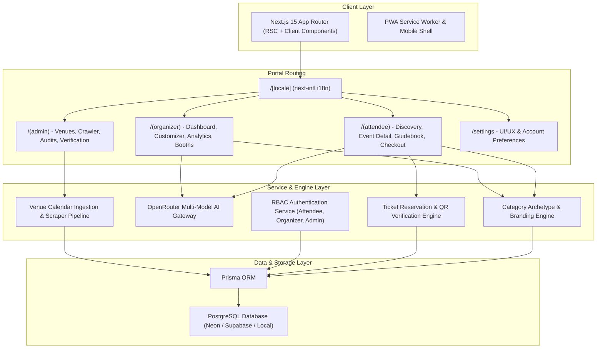
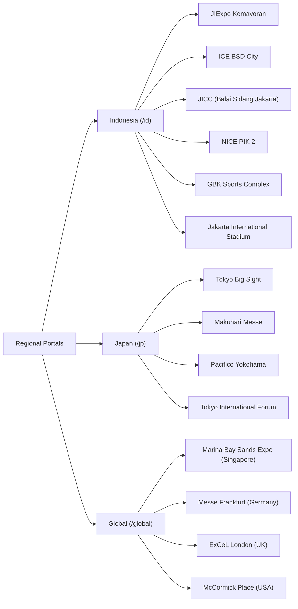

# XPO: Multi-Platform MICE Ecosystem Architectural Specification

**Document ID:** `SPEC-2026-08-20-XPO-001`  
**Status:** Approved for Implementation Planning  
**Target Environment:** Web (Next.js 15+ App Router, TypeScript, Tailwind CSS, Prisma ORM)

---

## 1. Executive Summary & Platform Overview

**XPO** is a multi-sided MICE (Meetings, Incentives, Conferences, and Exhibitions) digital ecosystem. It connects attendees, event organizers, venue operators, and platform administrators within a unified, high-craft platform.

### Core Architectural Tenets:
1. **Zero-Emoji, High-Craft Design System**: Elegant, modern, institutional-grade aesthetics utilizing SVG iconography (Lucide), balanced typography, and responsive micro-interactions.
2. **Deep Regional & Venue Hierarchy**: First-class support for localized regional hubs (**Indonesia**, **Japan**, and **Global**), indexing exact venue halls, transit connections, and floor plans.
3. **Category-Driven Archetype Engine**: 9 domain-tailored UX archetypes providing specialized layouts, data density, and components for different MICE sectors, paired with opt-in organizer branding overrides.
4. **Dual AI Integration (OpenRouter Gateway)**:
   * **Attendee Side**: Opt-in floating AI Event Concierge for instant scheduling, transit, hall directions, and personalized event recommendations.
   * **Organizer Side**: Multi-model intelligence suite for daily executive digests, sentiment analysis, attendance velocity, and foot-traffic optimization using:
     * `google/gemini-3.5-flash-lite`
     * `google/gemini-3.7-flash`
     * `deepseek/deepseek-v4-pro-0813`
     * `qwen/qwen3.7-plus`
     * `openai/gpt-5.6-luna`
     * `google/gemma-4-26b-a4b-it`
5. **Interactive Event-Day "Treats"**: Digital ticket passes with secure QR verification, interactive live guidebooks, hall navigators, and tier-gated perks.
6. **Educational & Guided Architecture**: Structured in 12 granular, modular phases, each accompanied by an in-depth **Technical Learning Guide & Walkthrough** (`docs/guides/phase-XX.md`).

---

## 2. Core Architecture & Technology Stack



### Technology Matrix:
* **Frontend Framework**: Next.js 15+ (App Router, Server Actions, React Server Components).
* **Language & Type Safety**: TypeScript (Strict mode enabled).
* **Styling & Design Tokens**: Tailwind CSS with CSS Variables for dynamic archetype theming.
* **Component Primitives**: Radix UI / Accessible Headless primitives.
* **Icons**: Lucide Icons (Strict SVG vector rendering, zero emoji clutter).
* **Internationalization**: `next-intl` supporting localized routing (`/en`, `/ja`, `/zh-CN`, `/id`, `/de`, `/es`).
* **Database & ORM**: PostgreSQL with Prisma ORM.
* **AI Orchestration**: Unified OpenRouter API Client with streaming responses, JSON schema validation, and fallback handlers.
* **Animation Engine**: Tailwind CSS Keyframes + Framer Motion (governed by user motion settings: Off, Subtle, Expressive).

---

## 3. Regional Scopes & Detailed Venue/Hall Ingestion

The platform categorizes events globally while offering deep regional hubs with exact hall mapping:



### Venue & Hall Specifications (Seeded):
1. **JIExpo Kemayoran (Jakarta International Expo)**:
   * *Halls*: Hall A1, A2, A3; Hall B1, B2, B3; Hall C1, C2, C3; Hall D1, D2; Grand Ballroom; Open Space Arena.
   * *Transit & Access*: TransJakarta Corridors 2C & 12M, KRL Stasiun Rajawali & Kemayoran, Gate 1-9 Car Parks.
2. **ICE BSD City (Indonesia Convention Exhibition)**:
   * *Halls*: Exhibition Halls 1–10; Nusantara Hall (1A, 1B, 2, 3); Convention Hall 1–3; Outdoor 50,000 sqm area.
   * *Transit & Access*: BSD Link Shuttle, KRL Stasiun Rawa Buntu & Cisauk, Basement & Outdoor Parking.
3. **JICC (Jakarta International Convention Center / Balai Sidang)**:
   * *Halls*: Plenary Hall (5,000 capacity), Assembly Hall (3,000 capacity), Cendrawasih Room, Exhibition Hall A (5,500 sqm), Exhibition Hall B (6,000 sqm).
   * *Transit & Access*: MRT Istora Mandiri, TransJakarta JCC Senayan.
4. **NICE PIK 2 (Nusantara International Convention Exhibition)**:
   * *Halls*: Exhibition Halls 1–8, Atrium Central, Grand Ballroom, Waterfront Event Plaza.
   * *Transit & Access*: PIK 2 Shuttle Bus Network, Toll Interchange Direct Access.
5. **GBK Sports Complex (Gelora Bung Karno)**:
   * *Halls*: Istora Senayan, Stadion Utama GBK, Tennis Indoor Senayan, Basket Hall, Parkir Timur GBK (Outdoor Expo).
   * *Transit & Access*: MRT Istora Mandiri & Senayan, TransJakarta GBK.
6. **JIS (Jakarta International Stadium)**:
   * *Halls*: Main Arena (82,000 cap), West VIP Lounge, Concourse Level 3, Ancol South Plaza.
   * *Transit & Access*: KRL Stasiun Ancol / JIS, TransJakarta 14 & 14A.
7. **Tokyo Big Sight (Tokyo, Japan)**:
   * *Halls*: East Exhibition Halls 1–8, West Exhibition Halls 1–4, South Exhibition Halls 1–4, Conference Tower.
   * *Transit & Access*: Yurikamome Line (Tokyo Big Sight Station), Rinkai Line (Kokusai-Tenjijo Station).

---

## 4. Domain-Specific MICE Category Archetypes (9 Profiles)

Every event is matched to an optimized UI/UX Archetype. Organizers can opt-in to customize brand colors, logos, and hero media within strict structural constraints.

| # | Archetype Name | Target Events | Key Specialized Components | Visual Aesthetics & Palette |
|---|---|---|---|---|
| **1** | **Industrial & Manufacturing B2B Expo** | Machinery, Logistics, Automotive, Heavy Industry | Machine Specs Sheet, RFQ Quote Drawer, Booth Roster, B2B Meeting Slot Booking | Steel Blue & Slate, high-density tables, technical badges |
| **2** | **Tech, AI & Developer Summit** | Cloud, AI, Web3, DevCon, Hackathons | Multi-Track Keynote Schedule, Speaker GitHub/X Tags, Livestream Embeds, Workshop RSVP | Dark Futuristic Slate, neon accent borders, monospace code badges |
| **3** | **Medical, Healthcare & Scientific Symposium** | Clinical Conferences, Pharma, CME Workshops | Peer-Reviewed Abstract Reader, CME Credit Counter, Speaker Accreditation Badges | Ivory & Teal, serif headings, dual-column research view |
| **4** | **Financial, FinTech & Investor Forum** | Banking, Venture Capital, Crypto, Deal-Making | Deal-Room Booking, Pitch Deck Downloads, VIP Boardroom Pass Tiers, Encrypted Badge | Emerald & Gold, structured cards, strict verification indicators |
| **5** | **Pop Culture, Comic Con & Gaming Expo** | Anime, Gaming, Pop Culture, Cosplay | Cosplay Guidelines, Creator Alley Map, Autograph/Photo-Op Slots, Merch Loot List | High-contrast vibrant badges, card carousels, rich media |
| **6** | **Music Festival & Arena Concert** | Live Concerts, Multi-Stage Music Festivals | Real-time Stage Timeline, Setlist Sneak-Peek, Gate Entry Crowd-Meter, Wristband Guide | Dynamic stage color-coding, media-first hero banner |
| **7** | **Mega Exposition & Multi-Pavilion Fair** | Jakarta Fair, World Expo, Canton Fair, City Expos | Multi-Pavilion Hall Directory, Fireworks & Nightly Shows, Gate Crowd Map, Tenant Promo Radar | Expansive multi-zone navigation, vibrant festival accents |
| **8** | **Government, Policy & Diplomatic Summit** | Bilateral Summits, G20, ASEAN, Policy Forums | Protocol Briefings, Bilateral Meeting Scheduler, Delegation Lounges, Press Credentials | Austere Navy & Bronze, security clearance level badges |
| **9** | **Incentive & Luxury Corporate Retreat** | Executive Offsites, Partner Retreats, Galas | Daily Excursion Itinerary, Gala Seating Charts, Wellness Scheduler, Private Chauffeur Notes | Warm-Stone Minimalist, luxury editorial serif typography |

---

## 5. Comprehensive Settings Suite (UI/UX & Account)

Users and attendees have full control over their visual and interactive experience via a dedicated `/settings` page and topbar quick-toggle:

### UI / UX Settings:
1. **Theme Mode**: `Light` | `Dark` | `System Default` | `High-Contrast MICE`.
2. **UI Density**: `Comfortable` (Default spacious cards) | `Compact` (High-density tabular mode for trade show attendees).
3. **Typography Engine**:
   * *Font Family*:
     * **Modern Sans** (Default: Inter / Plus Jakarta Sans)
     * **Editorial Serif** (Playfair Display / Source Serif)
     * **Technical Mono Hybrid** (Geist Mono / JetBrains Mono accents)
     * **High-Legibility / Dyslexia-Friendly** (Atkinson Hyperlegible)
   * *Font Scale*: Small (90%), Normal (100%), Large (110%), Extra Large (125%).
4. **Motion & Interaction Style**:
   * `Off`: Strict no animations for low-end hardware or vestibular sensitivity.
   * `Subtle` (Default): Smooth micro-interactions, page transitions, and toast alerts.
   * `Expressive / Cinematic` (Opt-in): 3D tilt on event badges, staggered list reveals, ambient header glows, smooth drawer expansions.
5. **AI Concierge Assistant**: `Enabled` (Default floating button) | `Disabled`.
6. **Default Region Gateway**: `Auto-detect` | `Indonesia (/id)` | `Japan (/jp)` | `Global (/global)`.
7. **Preferred Currency**: `IDR (Rp)` | `USD ($)` | `JPY (¥)` | `EUR (€)` | `SGD (S$)`.

### Account & Profile Settings:
1. **Attendee Identity**: Full Name, Company / Organization, Professional Title, Avatar, Bio.
2. **MICE Interest Matrix**: Multi-tag selection (Industrial B2B, AI/Software, Medical, Pop Culture, FinTech, Green Energy, Government).
3. **Notification Preferences**: Ticket transaction emails, Day-of-event schedule change alerts, Early-bird ticket drops.
4. **Saved & Active Directory**: Bookmarked events, followed venues, active & past digital passes.

---

## 6. Attendee Experience: Discovery, Event Detail & Event-Day Treats

### Event-Day "Treats" (Tier-Gated Perks):
* **Digital Pass with QR Verification**: Rendered client-side via SVG QR with animated security watermark for rapid check-in.
* **Interactive Live Guidebook**: Schedule tracker with "Add to Personal Itinerary", live session countdown, room change notices.
* **Interactive Hall & Booth Navigator**: Visual SVG floor map highlighting booked sessions, sponsor booths, restrooms, and dining areas.
* **VIP Tier Perks**: Gated lounge access tokens, complimentary coffee vouchers, exclusive speaker presentation slide downloads.

---

## 7. Organizer Command Center & AI Intelligence Suite

### Multi-Model AI Report Generator (OpenRouter):
* **Available Models**:
  1. `google/gemini-3.5-flash-lite` (Ultra-fast real-time digests)
  2. `google/gemini-3.7-flash` (Balanced multi-modal reporting)
  3. `deepseek/deepseek-v4-pro-0813` (Deep reasoning & anomaly detection)
  4. `qwen/qwen3.7-plus` (Multi-lingual & trade data synthesis)
  5. `openai/gpt-5.6-luna` (High-polish executive prose)
  6. `google/gemma-4-26b-a4b-it` (Local/edge fine-tuned analytics)
* **Generated Report Types**:
  * *Daily Executive Digest*: Ticket sales velocity, revenue milestones, registration spikes.
  * *Sentiment & Feedback Synthesis*: Aggregating attendee ratings, survey comments, and complaint clustering.
  * *Foot-Traffic & Booth Optimization*: Recommendations for hall layout improvements and crowd distribution based on check-in heatmaps.

---

## 8. Database Architecture & Prisma Schema

```prisma
datasource db {
  provider = "postgresql"
  url      = env("DATABASE_URL")
}

generator client {
  provider = "prisma-client-js"
}

enum Role {
  ATTENDEE
  ORGANIZER
  ADMIN
}

enum EventArchetype {
  INDUSTRIAL_B2B
  TECH_DEV_SUMMIT
  MEDICAL_SYMPOSIUM
  FINANCE_INVESTOR
  POP_CULTURE_GAMING
  MUSIC_FESTIVAL
  MEGA_EXPO_PAVILION
  GOVERNMENT_DIPLOMATIC
  INCENTIVE_RETREAT
}

enum TicketStatus {
  RESERVED
  CONFIRMED
  CHECKED_IN
  CANCELLED
}

model User {
  id            String         @id @default(cuid())
  email         String         @unique
  name          String
  role          Role           @default(ATTENDEE)
  organization  String?
  jobTitle      String?
  avatarUrl     String?
  settingsJson  String?        // UI/UX & Account Preferences JSON
  interests     String[]       // MICE Interest Tags
  organizedEvents Event[]      @relation("OrganizerEvents")
  bookings      Booking[]
  aiReports     AIReport[]
  createdAt     DateTime       @default(now())
  updatedAt     DateTime       @updatedAt
}

model Region {
  id          String   @id // "id", "jp", "global"
  name        String   // "Indonesia", "Japan", "Global"
  code        String   @unique
  currency    String   // "IDR", "JPY", "USD"
  flagEmoji   String?
  venues      Venue[]
  events      Event[]
}

model Venue {
  id          String      @id @default(cuid())
  regionId    String
  region      Region      @relation(fields: [regionId], references: [id])
  name        String      // "JIExpo Kemayoran"
  slug        String      @unique
  city        String
  address     String
  latitude    Float?
  longitude   Float?
  transitInfo String      // Transit instructions (KRL, MRT, etc.)
  halls       VenueHall[]
  events      Event[]
  createdAt   DateTime    @default(now())
}

model VenueHall {
  id          String   @id @default(cuid())
  venueId     String
  venue       Venue    @relation(fields: [venueId], references: [id], onDelete: Cascade)
  name        String   // "Hall A1", "Nusantara Hall 2"
  capacity    Int?
  floorAreaSqm Float?
  events      Event[]
}

model Event {
  id              String         @id @default(cuid())
  organizerId     String
  organizer       User           @relation("OrganizerEvents", fields: [organizerId], references: [id])
  regionId        String
  region          Region         @relation(fields: [regionId], references: [id])
  venueId         String
  venue           Venue          @relation(fields: [venueId], references: [id])
  venueHallId     String?
  venueHall       VenueHall?     @relation(fields: [venueHallId], references: [id])
  title           String
  slug            String         @unique
  description     String
  archetype       EventArchetype @default(INDUSTRIAL_B2B)
  startDate       DateTime
  endDate         DateTime
  isFeatured      Boolean        @default(false)
  heroImageUrl    String?
  brandingConfig  String?        // Custom colors, banner override JSON
  ticketTiers     TicketTier[]
  agendaItems     AgendaItem[]
  booths          BoothTenant[]
  perks           EventPerk[]
  aiReports       AIReport[]
  bookings        Booking[]
  createdAt       DateTime       @default(now())
  updatedAt       DateTime       @updatedAt
}

model TicketTier {
  id          String    @id @default(cuid())
  eventId     String
  event       Event     @relation(fields: [eventId], references: [id], onDelete: Cascade)
  name        String    // "Standard Pass", "VIP Buyer", "Exhibitor Delegate"
  price       Decimal   @default(0)
  currency    String    @default("IDR")
  capacity    Int
  soldCount   Int       @default(0)
  benefits    String[]  // Array of perks
  bookings    Booking[]
}

model Booking {
  id           String       @id @default(cuid())
  userId       String
  user         User         @relation(fields: [userId], references: [id])
  eventId      String
  event        Event        @relation(fields: [eventId], references: [id])
  ticketTierId String
  ticketTier   TicketTier   @relation(fields: [ticketTierId], references: [id])
  status       TicketStatus @default(CONFIRMED)
  qrCodeHash   String       @unique
  checkedInAt  DateTime?
  createdAt    DateTime     @default(now())
}

model AgendaItem {
  id          String   @id @default(cuid())
  eventId     String
  event       Event    @relation(fields: [eventId], references: [id], onDelete: Cascade)
  title       String
  speakerName String?
  speakerRole String?
  location    String   // "Stage A - Hall 1"
  startTime   DateTime
  endTime     DateTime
  track       String?
}

model BoothTenant {
  id          String   @id @default(cuid())
  eventId     String
  event       Event    @relation(fields: [eventId], references: [id], onDelete: Cascade)
  companyName String
  boothNumber String   // "B12"
  hallName    String   // "Hall A2"
  industry    String?
  websiteUrl  String?
  logoUrl     String?
}

model EventPerk {
  id          String   @id @default(cuid())
  eventId     String
  event       Event    @relation(fields: [eventId], references: [id], onDelete: Cascade)
  title       String   // "VIP Lounge Access & Free Coffee Barista"
  description String
  tierRequired String? // "VIP" or null for all
  iconName    String   @default("Coffee")
}

model AIReport {
  id          String   @id @default(cuid())
  eventId     String
  event       Event    @relation(fields: [eventId], references: [id], onDelete: Cascade)
  authorId    String
  author      User     @relation(fields: [authorId], references: [id])
  modelUsed   String   // "google/gemini-3.7-flash"
  reportType  String   // "DAILY_DIGEST", "SENTIMENT", "FOOT_TRAFFIC"
  contentJson String   // Structured metrics & markdown
  createdAt   DateTime @default(now())
}
```

---

## 9. 12-Phase Development Roadmap & Guided Learning Curriculum

```
Curriculum Index:
├── docs/guides/phase-01-architecture-and-design-system.md
├── docs/guides/phase-02-prisma-modeling-and-mice-seeding.md
├── docs/guides/phase-03-multilingual-and-regional-routing.md
├── docs/guides/phase-04-discovery-engine-and-faceted-search.md
├── docs/guides/phase-05-category-archetypes-and-theming.md
├── docs/guides/phase-06-ticket-checkout-and-event-treats.md
├── docs/guides/phase-07-settings-suite-and-ai-concierge.md
├── docs/guides/phase-08-rbac-authentication-and-security.md
├── docs/guides/phase-09-organizer-command-center.md
├── docs/guides/phase-10-ai-multi-model-reporting-suite.md
├── docs/guides/phase-11-admin-governance-and-crawler.md
└── docs/guides/phase-12-pwa-seo-hardening-and-e2e.md
```

---

## 10. Verification & Quality Assurance Plan

* **Type Verification**: `tsc --noEmit` on every phase.
* **Linting & Code Standards**: Strict ESLint checking with clean SVG icon requirements (no unicode emojis in UI).
* **Automated Unit & Component Tests**: Vitest + React Testing Library for components, theme engine, and ticket QR hashing.
* **End-to-End Tests**: Playwright scripts verifying attendee discovery, ticket reservation, and organizer live customization.
